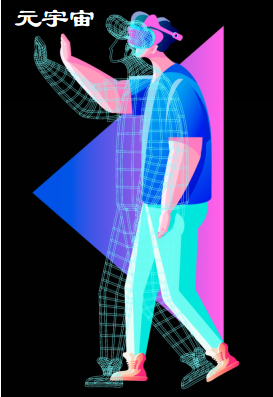

## 元宇宙时代的艺术想象力

时值当下Wab 3.0时代科技与想象力的全面爆发。

当下，科技、艺术与文化相互交叉融合，大数据、云计算、AI技术、数字孪生、人工智能等新一代的智能科技蓬勃发展下，如何将艺术与科技在融合中发展出新的道路，焕发出新的生机，成为当下时代中的重要命题。

几千年来艺术都是人类本体创造的，但在元宇宙时代，人类创造的效率和速度远远无法弥补大量的需求。而AI艺术时代出现，就是从PGC、UGC到AIGC的出现，这也是元宇宙艺术和传统艺术最大的区别。

元宇宙艺术需要强大科技的推动，它强调着能否在1秒钟触达几十万人，这意味着艺术家必须拥有多方面技能与知识。

今天我们看到的艺术，在元宇宙里面共同的平台很重要。元宇宙不是一家独大，不是创造一个伟人，而是无限可能的连接，平台的连接，才能的连接，人与人的连接，社群与社群之间的连接。而这些连接的每一个单元其实就是一个宇宙，每一个连接的单元的重要性。这是如花世界成功[的](http://www.jnbw.org.cn/?b=0)地方，因为它背后站着强大的人工智能和充满活力的青年血液。这跟我们过去的世界强调个人独占的风格，已经是一个不同的世界了。

所以艺术品再不只是衡量艺术家的唯一标准，恰当的阐述与展示，又足够引起共鸣，在大量认同的共享、回馈的下（相对的就是今天所谓的流量），交互、对应、沟通、连接的成为元宇宙的秘诀之一。

在未来，互联网进入物联网的年代，万物相联的年代，那已经不是传说了，那是一个从3G、4G、5G到6G的进程，它一定会发生的。而这个发生恰恰为我们每一个人都提供了我们可以自我茁壮的机会。

人类的发展是以工具来驱动，科技驱动了工具，工具直接驱动了我们，目前的艺术形式最大的部分会被完全重构，所以有各行各业的变化。