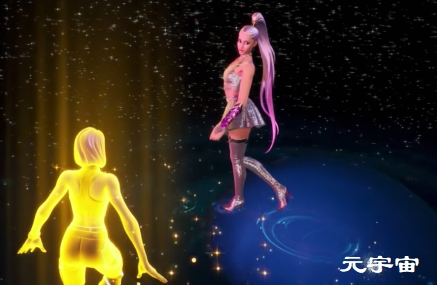

## 元宇宙时代

随着互联网的普及，区分“真实”生活和“数字”生活的界限变得越来越模糊。生活中的许多日常活动都能够在网络中重现，例如为游戏中的化身挑选服装、培养虚拟关系、建造虚拟家园、在虚拟商场与朋友会面以及举办全息会议等。随之而来的数字化转型的新时代将是元宇宙时代。

由虚拟空间组成的Metaverse可以让用户与其不在同一物理空间中的其他人一起创建以及探索 [1]。Metaverse由持久和共享的3D虚拟空间组成，这能用用户在其中与朋友聚会、工作、娱乐、学习、购物等。Metaverse的发展显然需要新的技术、协议和公司来处理它，并且随着时间的推移未来的期望是它能以不同的产品、服务和功能出现。

这仍然是一个有待回答的问题。根据 Dmarket 的首席执行官兼创始人Panchenko的说法，今天的虚拟世界是简化的虚拟物品或服务，无论是否使用虚拟现实 (VR) 仪器都可以访问。据他介绍，元宇宙将首先包括普适计算、非同质化代币（NFT）的区块链、虚拟现实（VR）和增强现实（AR）的扩展现实（XR）领域，并将进一步扩展到其他领域 [4]。

**哪些公司和产品已经进入了元宇宙时代？**

一些率先建立元宇宙的先驱行业是游戏、加密货币、时尚以及好莱坞。由于其 3D 环境、社交功能、角色个性化以及创建新环境的能力，在线游戏堡垒之夜（Fortnite）正在为互联网的未来奠定基础。Fortnite曾举办游戏内的现场音乐会，以吸引人们花更多时间沉浸在这些虚拟世界中。

2020 年 12 月， 时尚奢侈品牌Gucci和大型多人在线游戏创建平台Roblox合作构建了一个元宇宙的环境。Roblox 宣布 Gucci 为 Roblox 带来了一些稀有物品，Roblox 玩家现在可以使用 Gucci 系列（见下面的推文）。在Gucci Garden Archetypes中，Gucci 的沉浸式多媒体的体验呈现了 Gucci 的创意愿景，每个人都可以在 Roblox 上使用虚拟Gucci花园两周。Gucci在游戏中投放了限量版虚拟包，售价为4,115美元（350.000 Robux的游戏货币），超过了现实 3,400 美元的零售价。

当虚拟世界完整地建立起来时，人们将能够体验混合的虚拟和物理体验。此外，游戏广告将变得更加流行，因为游戏正在成为品牌和营销人员与目标受众建立联系的一个媒介。此外，由元宇宙技术带来的增强的购物体验将为带来更直观、身临其境和引人入胜的客户体验。最后，元宇宙的社区可以基于现实社会的价值观和标准的数字现实来建立。