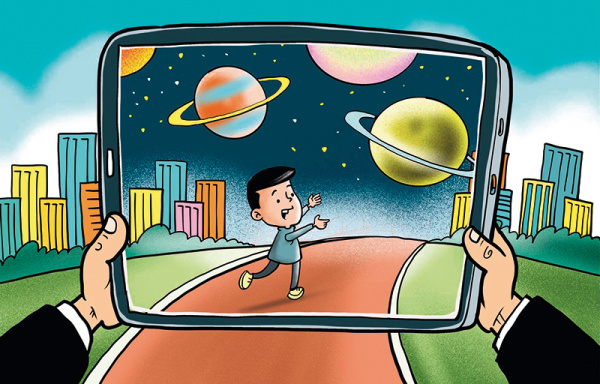

# 元宇宙愿景背后的政府与企业视点

**全球科技产业新热点**

元宇宙的英文Metaverse，是“超越”（meta）与“宇宙”（universe）的组合词。正如电话连接听觉、互联网连通信息，元宇宙可能进一步将“人-社会-宇宙”与“数字”交融在一起，实现“将现实世界复刻到数字世界”与“将数字世界投射到现实世界”的双轨融合。一些互联网人士认为，随着信息技术的快速发展，元宇宙可能成为互联网进化的未来形态，实现打破虚拟与现实隔阂的解决方案。

有观点认为，当前元宇宙虽还没有产生“杀手级”应用和产品，但近20年来世界的数字化发展都属于元宇宙发展的进展。随着相关技术成本的降低，用户群的培养，该概念有可能在5至10年后迎来爆发期。元宇宙真正来临时，或许是人类的数字生活大于物理生活的那一刻。

有风险投资界人士指出构建元宇宙需四大关键要素：可容纳同时在线人数的提升；能长久存在以吸引投资；活跃的虚拟经济；互操作性的标准和协议。这些前提体现出元宇宙的一些主要特征。

一是“去中心化”的开放平台。元宇宙的构建非一两个巨头所主导，也远非现在所流行的某款游戏或某个社交软件，而是一套能让所有应用程序与数字世界附着其上的生态系统，由不同国家、用户、企业等共同商榷框架规则。

二是融合现实。元宇宙与现实世界深度融合，若脱离现实世界的物质支撑将难以存在，也不会取代现实世界的存在，反而会成为现实世界的补充。现有的财富、社交、身份等一切信息，未来都可能在元宇宙中进行深度融合。

三是持续演变。元宇宙从混沌的散点开始，随着科技的进步、数据的丰富、用户的增多、资本的积累、相关基础设施的完善，以及社会的发展变化，不断进行自我更新、设计、完善、淘汰。

元宇宙演变为业界高度关注的投资风口，首先是因为多领域技术齐头并进，为元宇宙提供了技术支持。

元宇宙是当下多种尖端科技的超级综合体，先进科技充斥整个产业闭环。如，其内容生产依托人工智能、数字孪生技术；其存储和认证机制运用区块链技术；其数据处理运用人工智能、云计算、云存储技术；其网络环境构建依托5G技术；其虚实交互与联通运用人体感知、3D渲染、拓展现实、脑机接口、可穿戴、机器人技术等。这些技术当前均处于高速发展阶段，为元宇宙的发展积累了技术基础。

其次是数字生态的迭代和渗透需求。用户数与用户需求决定了数字生态利益体量。数字生态的开发方需要不断创造新的用户和用户需求，不断利用新技术提升数字生态的渗透广度和深度。在智能手机所孕育的数字生态基本达到极限后，开发者需要寻找新的途径打破智能手机在物理层面上的限制，进一步提升数字生态渗透率。新一轮信息技术革命中，数字技术与现实世界的结合变得更加深入，如果新一代信息技术可以对人进行新一轮赋能，增强人通过数字化平台感知世界、链接世界的能力，对于生产力将带来新一轮革命。元宇宙从概念上，符合数字生态迭代渗透与融合现实的目标。

此外，元宇宙概念的兴起也与人们对未来畅想的“情怀”有关。近年来，面对环境恶化、资源短缺、贫富分化、阶层固化等问题，越来越多科技主题的文艺作品开始畅想通过“元宇宙”式的未来数字社会改善现实世界。人们希望元宇宙建立真正的“地球村”，为普通民众提供分享数字创意红利的新空间，最终推动社会关系形态的演进。

**业界和政府的不同视角**

业界和政府对于元宇宙的看法基于不同的维度和逻辑。

业界将元宇宙视为新增长点和下一个具有战略意义的竞争领域，一些企业认为元宇宙开发过程将引发全球科技产业的新一轮洗牌。一旦该业态成为未来数字生态的主流模式，未能及时入局的企业或创新群体将面临被淘汰或者受制于人的局面。

2021年11月，英伟达、Roblox等四家知名科技巨头高管围绕“元宇宙愿景”举行大型讨论会。与会者鲜少谈论“竞争”，共识性地认为元宇宙将具有极大体量，需要采取合作并“花费很长时间去构建”。而这，也体现出了业界对于元宇宙的“拓荒心理”。业界各大巨头一方面专注于元宇宙某一个或某几个底层技术领域，力图成为该领域的研发领头羊并领导秩序制定，同时也深知面对巨大的产业体量，“独吞”既不现实也不可能，所以寻求全球的其他创作者互联互通，真正实现平台打通、技术融通、数据互通、标准一致。

以改名表达入局决心的Meta和英伟达是布局元宇宙最为坚决的科技巨头。Meta旗下的Facebook、WhatsApp、Instagram、Messenger在第三季度平均月度活跃用户人数达到29.1亿人，在“用户”这一最重要数据资源上占有极大优势。作为Meta旗下一个部门的现实实验室将成为该公司开拓虚拟现实和增强现实终端、构建虚拟现实平台的主要依托。

英伟达以“芯”为本，着力搭建元宇宙的硬件平台。2021年度GTC大会上，英伟达创始人黄仁勋公布了一系列最新AI技术和产品，并推出承载着其“元宇宙”愿景的全新虚拟化身平台OmniverseAvatar。该平台可能成为元宇宙的创建和孵化平台，提供给广大数字创意公司使用。英伟达不仅正在利用芯片技术帮助渲染元宇宙世界，也在推动通用场景描述标准（USD）的制定，以统一虚拟世界的物理规则，实现元宇宙相关设备和软件的兼容。

各国政府则从另一个角度看待这一概念。由于元宇宙的产业发展仍存在较大变数，是否追求这一产业的潜在商业利益并非政府优先考虑的范畴。政府认为一旦元宇宙成为未来数字生态的主流模式，可能会产生新的国际分工体系，而缺乏相应筹码和竞争力的国家将处于不利局面，在这一新体系中被边缘化。

对于此类前沿业态，政府需要平衡“发展”与“安全”，既不落战略先机，又规避安全隐患。因而他们在考量元宇宙对本国国内政治、社会领域的潜在风险基础上，更关注元宇宙对国家间竞争产生的战略影响。

美国政府对于元宇宙仍处于观望状态，尚未提出明确的元宇宙建设纲要性文件和官方表态，其对于元宇宙的“求稳心态”与“政治眼光”更加浓重，对数据安全的担忧及产业巨头垄断风险的警惕暂时占据上风。

10月，美国两党参议员提出《政府对人工智能数据的所有权和监督法案》，要求对联邦人工智能系统所涉及的数据特别是面部识别数据进行监管，并要求联邦政府建立人工智能工作组，以确保政府承包商能够负责任地使用人工智能技术所收集的生物识别数据。这一新规体现出美国国会对于基于数据与身份识别的数字化渗透持谨慎态度，元宇宙同样基于类似技术理念。

另一方面，美国企业持续推动美国政府加强对元宇宙的认知，以塑造有利的竞争和创新环境，让美国相关产业在全球脱颖而出。Meta等科技巨头正积极与美国政策制定者、学者、合作伙伴和专家洽谈，以帮助其以“负责任”的方式来构建元宇宙版图，并试图与各方为元宇宙虚拟世界创建标准和协议，塑造科技巨头对于新兴互联网形态的自我监管模式。美国政府与业界间的博弈短期内难见分晓。

韩国则成为对元宇宙有较强紧迫感、危机感的国家。当前，韩国已出现从用户群体到平台搭建者共同营造的元宇宙热潮，政企合作共同布局该领域。

韩国成立了由政府领导、囊括200多家公司和机构包括SK电讯、现代汽车、韩国移动互联网商业协会等的“元宇宙联盟”，合作进行元宇宙层面的道德与文化实践，分享技术趋势及见解，并启动联合开发项目。三星等巨头也积极为元宇宙搭建资本基础，推出元宇宙基金并大受欢迎，有望于今年底实现融资1000亿韩元的目标。Meta宣布全面进军元宇宙后不久，首尔市政府就公布了建立元宇宙公共服务平台的相关规划，作为其最新未来城市规划“首尔愿景2030”的一部分。

日本寻求扶持相关产业，建立新型国家优势。日本经济产业省于7月发布《关于虚拟空间行业未来可能性与课题的调查报告》，将元宇宙定义为“在一个特定的虚拟空间内，各领域的生产者向消费者提供各种服务和内容”。报告认为，该行业应将用户群体扩大到一般消费者，应降低VR设备价格以及VR体验门槛，并开发高质量的VR内容留住用户；政府应着重防范和解决“虚拟空间”内法律问题，并对跨国、跨平台业务法律适用等加以完善；政府应与业内人士制定行业标准和指导方针，并向全球输出此类规范。这些建议体现了日本政府对元宇宙行业布局的思考，即通过现有的发展成果尽可能在民众范围内推广元宇宙理念，同时通过指导与政策制定来规范元宇宙的建设。

欧洲对元宇宙持高度谨慎态度。欧盟《人工智能法案》、“平台到业务”监管法规、《数字服务法案》《数字市场法案》等立法说明了监管机构在处理元宇宙时可能采取的立场和倾向，包括增加透明度、尊重用户选择权、严格保护隐私、限制一些高风险应用。这些立法预示着欧盟更关注元宇宙的监管和规则问题，试图在治理和规则上占据先发优势，进而保护欧洲内部市场。

总的来讲，元宇宙有可能激发数字经济更大的活力。构建元宇宙需要的基础设施、资源、受众等多方面的同步到位，建成后对解决空间、时间等稀缺资源的限制或有价值，甚至可能刺激新一轮的科技革命，带动从现实到虚拟的多个产业进一步潜力挖掘。

先行投资元宇宙可能帮助政府、企业成为未来这一重要数字空间的规则确立者、标准制定者、行业领导者，并主导新的分工体系。元宇宙还可能促发人们更大的创造力，促进不同国家、社会、文明背景的人交流互鉴。

**潜在的风险挑战**

元宇宙仍处于发展过程之中，是否能成为未来数字生态的主流模式还有待深一步观察。但是，作为蕴含前沿技术集成的新兴数字生态，元宇宙的技术特征和发展形态已初步提出了一些潜在的风险挑战。

第一是产业霸权挑战。虽然元宇宙具有“去中心化”特点，但是与以往前沿技术和数字生态类似，长期的行业演进极易在最终形成“中心化”的巨头、国家。

及早入场的头部公司通过科技研发、资本积累将获得巨大优势，在赛道上展现出超人一等的身位优势，而这些垄断性的巨头届时将掌握更全方位的信息与数据，大数据杀熟以及信息茧房将更加常见，对国家安全、公民安全、信息安全造成持续挑战。

而元宇宙在全球各国、不同企业的发展和应用速度也将呈现高度不均衡的状态。一些国家的现有技术水平、国内市场、用户群体、数字生态、产业链和创新环境较为适宜元宇宙的发展，而另一些国家可能由于主观因素或客观限制发展相对滞后。

国家间的发展差距当前并不明显，但随着时间推移会迅速放大。这种差距将带来三个领域的影响：其一，发展较为滞后的国家寻求接入发展领先国家的元宇宙时将处于不利地位，可能面临歧视性的门槛和要求。其二，发展较为落后的国家在元宇宙相关技术和产业链上可能存在短板和空白，即便其想通过自身努力进行追赶，也可能需要承担较高的成本，或者在此过程中加大对他国技术和标准的依赖。其三，国家之间可能因对于元宇宙的看法、立场和监管方式的差别，导致国家间数字经济发展模式、数字生态和产业链出现“分叉”，形成相互隔绝的系统，原本希望构建的“地球村”反而遭受反作用力。

第二是技术安全挑战。数字技术和数字生态的安全问题或安全隐患经常难以被事前发现，元宇宙由于集成了诸多信息技术，其安全隐患可能更加突出、多元。

第三是社会变革挑战。一项革命性的前沿技术或数字生态会对一国乃至各国的政治、经济和社会带来深远影响和冲击。元宇宙所带来的冲击可能发生在以下层面。

政治层面。元宇宙可能成为一国政治思潮和社会文化的组成部分，对一国的政治安全和文化安全带来潜移默化的影响。由于在立法、管理等方面无前例可循，很多制度层面的设计需要经历“从无到有”的孕育。

经济层面。元宇宙将带来数字生态的产业更替，一些在数字创意上具有先发优势或历史积淀的国家可能更适应元宇宙转型过程，而另一些国家可能面临他国元宇宙生态对于本国文化和数字经济的竞争，一些相比元宇宙数字体验较差的企业和产业可能面临被淘汰的风险。同时，元宇宙也可能出现资本剥削。在Gamefi等平台上已经出现了通过玩游戏赚取金钱的游戏劳工，这一方面代表虚拟经济变现越发普遍，但同时随着更多民众加入以及人力成本的降低，元宇宙极可能成为资本剥削廉价劳动力的新矿场。此外，元宇宙也可能成为经济犯罪、腐败的新渠道。

社会层面。元宇宙可能带来就业替代和社会结构的深刻变化，并带来一些新的社会问题。谣言传播、社会关系、伦理道德、身份识别等都可能以新的形态获得更大的影响力与破坏力，特别是对世界观尚在形成过程中的Z世代产生巨大影响。例如，元宇宙的高沉浸式体验可能对青少年成长带来消极影响，也可能被改造成带有成瘾性的“数字毒品”。极端主义与恐怖主义也可以借助这一“法外之地”的管理空白期为所欲为。

第四是大众心理挑战。一是混淆“虚拟与现实”。元宇宙的沉浸性特质，可能导致部分用户长期沉浸于元宇宙之中，其认知和行为与现实世界的人们脱节，带来明显的代际差异与矛盾冲突。

二是持续弱化人对现实世界的兴趣。短视频与碎片化信息的蓬勃发展让不少人耐心获取长信息、感知世界的能力弱化了，而一旦三维层面、包罗万象的元宇宙建成，原有的真实社会的文化、艺术、讯息等也可能丧失其吸引力。

上述这些挑战与风险使得元宇宙发展的规则建立及监管体系至关重要。

政府需要在监管过程中提前做好技术规则和道德伦理标准的准备。企业也需要以负责任的姿态，在充分尊重隐私、充分保障安全、充分保护文明的基础上审慎发展元宇宙。由于元宇宙具有跨国特征，国际社会应对元宇宙开展探索性、建设性的合作与沟通，引导这一新兴领域朝向健康有序的方向发展。