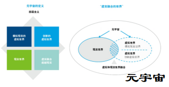

## 元宇宙纵观——愿景、技术和应对

近日，德勤中国推出《元宇宙综观——愿景、技术和应对》，探讨元宇宙的未来发展愿景，分析当前技术发展阶段及应用案例，梳理产业相关架构，并探讨企业应对之道。

德勤从“**Meta**（元）+ **Verse**（宇宙）”的本意出发，去定义和设想元宇宙的未来，即元宇宙是“虚实融合的世界”，包含4层含义：

含义一：模拟现实的虚拟世界。元宇宙将包括一个模拟现实世界的虚拟世界，具有现实世界的全部要素，包含身份、商业、娱乐、社交、文明、治理等，以及现实世界最重要的特征之一——感受。这是理解和设想元宇宙未来发展方向很重要的一个出发点。

含义二：创新的虚拟世界。元宇宙包括一个创新的虚拟世界，具有完全虚拟创造出来的人、物品、环境、规则等。这个创新的世界也具备现实世界的所有要素。

含义三：元宇宙包括现实世界。未来所有现实世界的元素都会在虚拟世界产生镜像，并与现实世界互动产生意义和价值。从这个意义上说，元宇宙是包括现实世界的。

含义四：虚实融合超越现实。第一点是虚实融合互动：长远看，虚拟世界和现实世界会形成紧密融合和互动——由虚到实、由实到虚，虚中有实，实中有虚。第二点是虚实融合的入口：第一种是应用数字工具，包括各种便携可穿戴的AR/VR设备等，第二种是应用脑机接口技术直接将相关的电信号通过无线脑机接口提供给人脑，进行实时、无障碍地信息交换，以此自由进入元宇宙。

