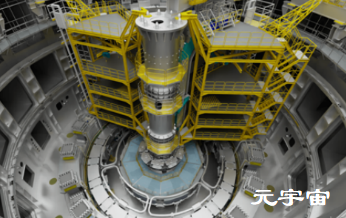

## 元宇宙愿景：以数字孪生构建面向未来的基础设施

元宇宙已经成为一个理想的未来，而基础设施元宇宙是其不可或缺的重要组成部分，因为我们不能脱离物理世界而生存。有专家认为，数字孪生是元宇宙伸到当下世界的触角，也有专家认为，数字孪生是构建未来元宇宙的核心技术体系。不管怎么说，元宇宙和数字孪生密不可分。

作为基础设施数字孪生领域的领袖级企业，Bentley软件公司如何利用数字孪生技术构建基础设施元宇宙？在英伟达举办的GTC 2022大会的媒体访谈中，Bentley软件公司应用集成副总裁Lori Hufford分享了Bentley独特而有启示性的观点与实践。

**问：请您用一句话来说说对元宇宙的看法。**

**Lori Hufford：**我们认为元宇宙是沉浸式和互动式的。通过基础设施元宇宙，人们可以在设计、建造和运营世界基础设施的过程中，将自己化身或沉浸到基础设施的数字孪生模型中，或使用来自数字孪生模型的信息增强物理世界。

**问：Bentley软件公司作为一家基础设施软件公司，从数字孪生技术的视角来看，元宇宙的作用在哪里？**

**Lori Hufford：**由于基础设施的数字孪生模型是物理世界的数字化表达，并使用物理世界的信息进行持续更新，因此数字孪生模型必须包含丰富的工程 BIM 数据，并且能够通过物联网连接设备（如传感器和无人机）跟踪和可视化现实世界环境的变化。与娱乐业不同，基础设施数字孪生模型必须具备毫米级精度，在地理空间上保持一致，并支持复杂的工程架构。那么，元宇宙的作用是什么？通过元宇宙，人们可以在设计、建造和运营现实世界的基础设施的过程中，将自己化身或沉浸到这些数字孪生模型中，或使用来自数字孪生模型的信息增强物理世界。

**问：Bentley软件公司对元宇宙在工业方面的工作重点是什么？**

**Lori Hufford：**我们正在研究各种方法，将数字孪生技术和元宇宙的优势引入到基础设施中。在基础设施全生命周期的各个阶段，都有许多应用场景。

在设计过程中，人们可以与数字孪生模型互动，在全球范围内进行跨专业的设计校审。引入模型、实景环境和地图来识别问题所在，在设计过程中引入变更可视化，就变更进行沟通，以及使用数字化工具进行验证。

在施工过程中，可以使用增强现实技术来可视化和审查施工程序，降低风险，从而获得更好的成效。

在运营期间，可以使用采用了基础设施数字孪生模型的增强现实技术，通过模拟仿真或通过远程检查提高安全性。关键在于，数字孪生模型必须具有工程级质量、毫米级精度且包含结构化的工程元数据，这样才能带来实际效果。

**问：请您简单谈谈元宇宙工作流程。**

**Lori Hufford：**现在要使元宇宙得到有效利用，那么必须能够将其轻松融入到用户现有的业务流程中——欲善其事，必先利其器。元宇宙必须可以用于现有的工作流程中，并且可以充分有效利用现有的基于网络、面向团队和流媒体等工具。元宇宙还必须具备开放性，让用户可以开发他们自己的元宇宙应用程序。

例如，不少大型组织正在使用通过摄影测量法创建的模型进行远程桥梁检测，更有效地应对基础设施老化的挑战。他们通过有效利用数字孪生模型，开展及时的交互式跨专业的设计审查，改善设计成果。

**问：哪些是给您留下印象最深刻的基础设施元宇宙成功案例？**

**Lori Hufford：**其中一个令人振奋的例子是ITER项目。在法国，来自 35 个国家和地区的代表正在合作建造托卡马克——一种又被称为“人造太阳”的磁聚变装置，以证明使用聚变作为大规模无碳能源的可行性。这一巨型设计和施工项目包含众多复杂的工程模型和数以百万计的零部件。托卡马克必须先行在外场建造再吊装到位。ITER 希望让人们能够身临其境地体验数字孪生模型。他们创建了 CATIA 模型并将其导入到SYNCHRO施工模拟程序中，后者基于Bentley iTwin平台构建，用于进行4D施工模拟。然后，ITER利用Unreal Engine以及Omniverse和Cloud XR，营造出一种令人惊叹的虚拟体验，让设计团队能够沉浸其中。保真度非常重要——我们必须能够在打造仿真体验的同时不降低模型的复杂性。这是客户第一次能够让用户沉浸在模型中。照片实感的照明增强了体验，而且基础设施的数字孪生模型包括了充分利用未来的体验所需的全部工程数据。

**问：在未来1年、5年乃至10年内，元宇宙可以实现哪些真实成果，您对未来有何展望？**

**Lori Hufford：**当然，通讯将不断演进和改善，包括人与人、人与资产、资产与资产以及包括XR在内的各种模型之间的通讯。当资产遇到需要维修的状况时，将发出警报，并指导维修工人完成维修过程。

通过提供人与资产互动的虚拟大厅，元宇宙将进一步让我们拥有更强大的能力来设计、建造和运营基础设施。例如，全息图可以让远在外地的专家实现现场咨询。

正如我之前提到的，我们需要管理我们与自然世界的关系。在Bentley，我们希望成为地球的忠诚守护者。由于基础设施数据的庞大规模和复杂性，我们需要找到理想的架构和软件设计，减小计算需求，降低碳排放量。