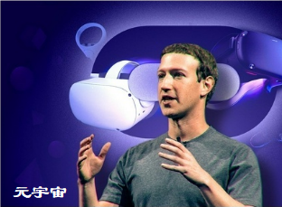
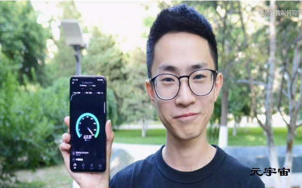
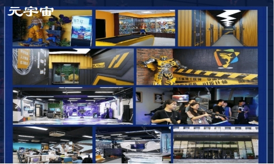

# 元宇宙，5G的大门

2021年9月初，因为一场收购事件，“元宇宙”一词开始进入大众视野。

这之后不久脸书首席执行官扎克伯格向他的员工表示，未来几年，脸书将从一家社交媒体公司转变为一家元宇宙公司。

马化腾也在几年前提出一个能够“由实入虚，帮助用户实现更真实体验的全真互联网”，这与元宇宙的概念十分类似。

元宇宙的英语是**Metaverse**，这个概念最早出现在1992年美国作家尼尔·斯蒂芬森的科幻小说《雪崩》中。

目前来看，2018年斯皮尔伯格导演的科幻电影《头号玩家》，被认为是最符合《雪崩》中描述的“元宇宙”形态。

在《头号玩家》设定的场景里，人们通过头盔设备，将意识与平行虚拟世界连接，在“游戏”设定的一套完整运行的虚拟社会里，通过控制自己的“虚拟分身”进行一系列的社会活动。

元宇宙火起来有两方面的原因，一是疫情，减少了人们的物理联系，二是5G和VR技术的发展。

比如在2020年，美国加州大学伯克利分校因疫情原因，无法现场举行毕业典礼。学校于是决定在游戏“我的世界”这个虚拟世界中，搭建了一个和真实校园高度一致的“虚拟校园”，学生们通过相应的设备，以“虚拟分身”的身份来到“虚拟校园”参加毕业典礼。

就像“老师好，我叫何同学”说的一样，5G时代，下载速度将是5G最无聊的应用。

中鲨科技正是抓住这一时机，决定自主研发游戏。

从2020年开始，中鲨科技又开始布局游戏领域，并在手游和端游领域初露头角。开发研制了游戏盒子—劲游天下，和长期合作的游戏公司形成代理关系，开始尝试游戏运营，并取得显著的成果。

“我们创造的，不是一个产品，而是一种文化。”中鲨科技项目组的员工对这句话非常熟悉，这是他们每天都要听无数遍的工作准绳。这要求无论建模师还是原画师，在创作一个角色的时候，不但形体上要足够精致，同时也要赋予每个角色精神的感染力。

每个游戏公司其实都想成为迪士尼，中鲨科技也不例外，因为我们知道文化的可怕力量。

终有一天你会体验到中鲨设计研发的角色，并在中鲨创造的游戏场景中徜徉。