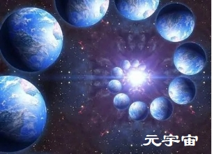
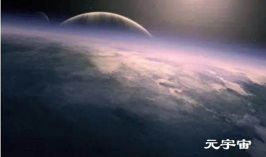

## 元宇宙的十四个应用场景

### 1、游戏

越来越多的游戏会参与到元宇宙中——它们已经是元宇宙的一部分——但它们将越来越具有沉浸感（更适应空间位置感、更具社交性、更具互动性），并由呈指数级增长的创作者共同精心打造。

### 2、社交体验

以游戏中虚拟世界的大部分技术为基础，元宇宙将使我们能够通过“真实”活动感受进行社交，而不仅仅是通过分享照片和新闻链接进行社交。

### 3、沉浸式商务

迄今为止，电子商务领域最大的成功是围绕人与人之间的低接触社交和自主购买行为。

传统零售商业仍然擅长于消费者喜欢的高接触社交、购买咨询等场景。

### 4、线上协作

我们已经通过Zoom、Slack、钉钉、飞书等工具进行互联网协作。但在未来，更有挑战的技术给互联网协作带来更强的沉浸感。

### 5、线下房地产

尽管我认为人们要想完全通过VR购买房屋还需要一段时间。

但VR很可能成为人们预先筛选他们感兴趣房产的一种重要方式，以及帮助用户反复参观和检查有关房产的更多信息。

随着元宇宙参与到线下房地产行业，元宇宙的体验将更具有社交性和交互性。

### 6、旅行

旅行是最昂贵和增加环境负担的行业之一。

也许某天，元宇宙能让我们参观世界上任何一个有趣的地方。

Matterport已经能通过VR参观五个埃及遗址：Meresankh三世女王的古墓遗址VR目前，元宇宙中的大多数旅行都是静态的、预制的、“单人”体验。

### 7、建筑、工程和设计

说到协作，NVIDIA 的 Omniverse正在创建一个交互的互联网协作空间，让建筑师、工程师和设计师可以在一起共同设计空间。

你甚至可以将流体动力学的 AI 模型以及不断增长的现实世界物理库整合到虚拟环境中。

Omniverse中的流体力学

### 8、汽车

汽车一直以来都是电子游戏的魅力所在，当然这也将在元宇宙中继续下去。

元宇宙将为汽车行业带来大量的新案例。

就像建筑一样，元宇宙将为设计车辆提供一个协作的社交空间。它将为测试汽车，特别是自动驾驶提供一个模拟环境。有一天，你可能会和你的家人一起参观虚拟陈列室，以决定要购买的车辆。

### 9、学习和教育

尽管在疫情期间我们努力开展线上教育，但现在我们的技术选择和体验还很有限。

随着将线上教育转变为更具沉浸感、更具社交性的方式，体验将会越来越好。

为教师提供足够能发挥出创造力的线上交互工具，将能使来自任何地方的优秀教育工作者都发挥作用。

元宇宙中的很多全新的交互方式，将使学习体验变得更加有趣。

### 10、健身

我想我再也不会去健身房了。

在疫情期间，大家经常在家使用健身APP，并且可以通过线上视频与自己的私人教练交流。

超自然VR将健身带入了元宇宙，并使其更具互动性和社交性。

### 11、立体直播

直播目前是一对多的社会化体验，非常适合展示游戏和教学。直播已经是元宇宙的一部分了。

不过直播还会进一步迭代。

随着元宇宙内的直播变得立体化，直播将变得比现在更具有沉浸感和社交性。

### 12、电子竞技

作为一种观赏性运动，电子竞技的用户数量非常庞大，而且还在不断增长。

如果你从未花时间去感受这些活动中现场的激情，那么现在就花点时间来看看这个视频，来感受一下这种感觉:现在：想象一下，当我们将更多的激情、社交和社区方式转移到元宇宙中，会发生什么？

### 13、现场音乐

现在，你主要用手机看音乐视频或者听音乐音频。

当然，这种情况还会继续——但是元宇宙能给你带来前所未有的音乐体验。

堡垒之夜和Roblox的现场音乐会已经吸引了数以千万计的粉丝，创下了纪录——但这仅仅是个开始。

在元宇宙中有一个全新的交互、社区和增强体验领域。

其中一些体验不仅仅是现场音乐会的替代——它们会更好。

因为元宇宙的内容将足够丰富，传统现场音乐的前排座位将从一种稀有商品变成任何人都可以体验的东西。

### 14、沉浸式剧场和物理世界的交互

我上面写的大部分内容都是关于进入完全的数字空间——但是元宇宙也将包括我们实际旅行到的真实空间内的活动。

我们能将元宇宙带到真实物理世界中。

万物互联将为元宇宙提供数据，地理空间触发的内容和对应的数据将进入元宇宙。

让我们以新的方式理解、操纵和模拟现实世界，从而节省我们的时间，并为我们的生活和业务开启新的可能性。

这种信息无处不在的工业、旅游、军事、民用和住宅应用的未来是无限的。像实体密室游戏、剧院、音乐会和现场实况这些，都可以用AR/VR特效、新技术来提供实体和虚拟的混合增强体验。

## 结论

元宇宙是下一代互联网。

它将通过你和你朋友、同事喜欢的事物为你们提供全新体验。

全新的工具将为元宇宙创作者提供各种混合嵌入和链接内容的能力，创作者的数量将呈指数级增长。

这是一个新的时代，元宇宙会带你去从未想过的地方。