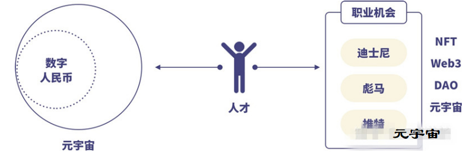

## 《元宇宙的原理与机会》

## **1. 我是怎么接触到元宇宙的？** 

和大多数人一样，最开始是因为Facebook改名字引起关注的，也是这时，工作内容的重心转向了元宇宙，这促使我开始深入研究元宇宙。我发现，早在2020年年底的时候，马化腾就在公司年刊上提了“全真互联网”的概念，这个概念里描述的业务是和元宇宙类同的。

2021年7月的时候，微软在开发者大会上就明确，要把公司的资产重新评估打包，入局企业元宇宙。到2021年10月末尾，Facebook把公司的名字改为Meta，这标志着元宇宙正式爆发。

接下来的时间里，元宇宙蔓延到各行各业。2021年12月2日，网易云音乐在港交所挂牌上市时，顺便举办全球首个“元宇宙”上市仪式，线下仪式敲锣的丁磊本人、29岁和50岁的AI虚拟人“丁磊”三人同时敲钟，不仅跨时空跨地区，还做到了虚实结合。

传统企业对元宇宙的布局甚至比互联网还快，比如阿迪达斯、耐克、奈雪的茶、宝马汽车等都高调落地元宇宙项目。接下来就是明星们入局了，某知名歌手花了78万人民币在元宇宙游戏Decentraland里面购买了土地、周杰伦旗下的潮牌在全球最大的NFT交易网站Opensea上架了NFT、舒淇冯德伦参加元宇宙游戏Sandbox里的活动。

在这个过程中，资本也没停下来，根据不完全统计，2021年10月到2022年1月三个月期间，全球针对元宇宙赛道的投资超过9.5亿美元，比如，红杉资本和软银参投了元宇宙链游Sandbox，其中，软银投了9300万美元。国内的融资也比较多，比如，基石基金投了工业元宇宙平台DataMesh近亿元人民币，而小米和明势资本共同投资了元宇宙服务器蔚领时代近4亿人民币，这样的投融案例还有很多。

元宇宙的火爆，让大公司开始马不停蹄地布局，比如腾讯投资Roblox、微软曾687亿美元收购魔兽世界的母公司动视暴雪布局元宇宙。中腰部的公司呢？都在积极评估资产和找机会入局元宇宙。小公司和小团队也很积极，数字藏品一天十个样地发布，上线就售罄的案例比比皆是。

##  **2. 为什么要了解元宇宙？** 

有人认为，元宇宙还离我们很远，这是是未来十年二十年的事情，但实际上它正在快速逼近我们。正如前面提到的，国内外的各行各业都在转向元宇宙，就在该内容写下时，沃尔玛、现代汽车、松下电器、巴黎世家、中国电信等等都入局元宇宙了。

从这些市场动态来看，我们很有必要去了解元宇宙，我从两个层面剖析给你听。

先说个人层面。
国家在推进元宇宙，已经确定的一百多个试点单位里，元宇宙可用在的领域包含：政务服务、版权、法治、教育和金融等领域。而近期数字人民币被民众热捧，数字人民币是能应用在元宇宙里面作为结算代币的。风口和工具都来的太快，但缺人才去落地，对我们个人来讲，这意味着什么？当然是职业机会。
你还觉得这不够信服？
我们继续看，做超市的沃尔玛、做泛娱乐的迪士尼、做运动服饰的彪马等也入局了。
并且，迪士尼和彪马已经在招聘平台领英上招聘数字文化经理职位，要求应聘人员了解NFT、Web3、DAO、元宇宙。接下来，企业对这类人才的需求会增加，我们可以提前储备知识，平滑过渡到另一个更有前景的赛道里。

