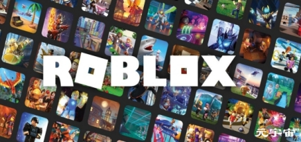
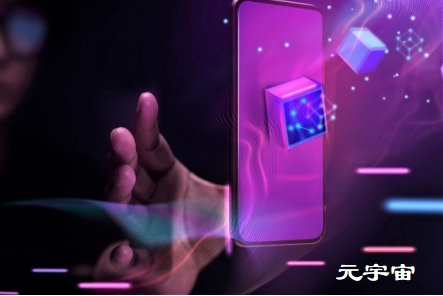
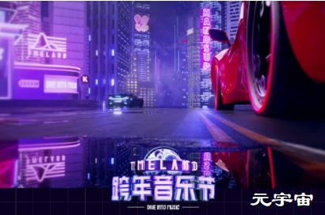
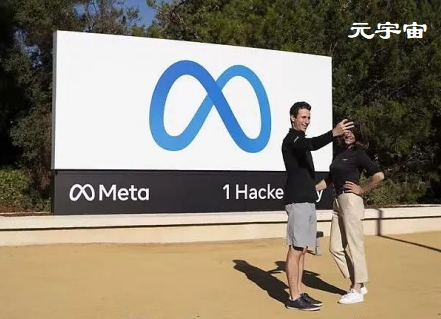

## 元宇宙时代已经到来！

从今年元宇宙这个概念爆火开始，关注度就飙升，2021年可以说是元宇宙元年，2022年元宇宙将会迎来爆发期，并且呈现出势不可挡的趋势，就像区块链专家蔡维德教授在接受采访时说的：“趋势来临不要试图阻挡，而应该去完善和助推发展，也不要怕被质疑和谩骂，毕竟过去互联网时代到来的时候也被骂了十年之久。”

 **“元宇宙不是概念，它已经到来”**

或许在国内很多人还觉得元宇宙虚无缥缈，但在国外，元宇宙已经不仅仅停留在概念层面了，Facebook早在2014年就开始布局元宇宙，暗地发展了8年，在美国元宇宙已经悄悄上线，在全球疫情肆虐的情况下，有人已通过元宇宙举行了长途会议。

“元宇宙已经是可以看得到并开始应用的，只不过目前还是一个非常早期的阶段，随着科技的发展，每一年元宇宙都会大不一样，并且变化越来越快，对我们的生活也会产生很大的影响和变化。”

元宇宙的“第一把火”是2021年3月由在线游戏平台**Roblox**在美股上市点燃的，该公司明确提出要打造元宇宙，上市首日股价涨幅达54%。而元宇宙的真正爆发是今年10月，扎克伯格宣布将Facebook改名为Meta（即“元宇宙”一词Metaverse的前缀），此举成为本轮元宇宙流行最重要的催化剂，将其热度推高到巅峰。

**Facebook为什么更名为“Meta”？**

这是互联网巨头突破瓶颈的需要。当前不仅Facebook的用户数基本见顶，商业模式也见顶了。2021年Facebook被欧盟重罚后，损失很多钱，没办法完成原定目标。而且苹果公司允许大家拒绝提供数据给脸书，脸书一下失去了大量的数据，如果再继续下去，脸书连存活都可能有问题。

如今移动互联网也进入了瓶颈期，下一步向何处发展？Facebook说是元宇宙。这也和VR、5G、虚拟现实等技术的成熟有关系。而且Facebook在VR上投资多年，至今未见到收益，通过推动元宇宙概念，可以让其在VR技术上的投资获得回报。

**“白热化”阶段**

 

元宇宙在国外已经到了十分白热化的地步，在美国一个非常出名的商业杂志上曾写道‘你必定需要投资元宇宙公司’，语气十分强烈。还有一些市场调查显示元宇宙将给市场带来巨大改革，每一个公司都必须在元宇宙上重构它的品牌。从这些种种迹象可以看到，国外已经把元宇宙定位得很高，并且预测元宇宙将会走得更远。

我们再看回国内元宇宙的现状，元宇宙爆发后，质疑声也随之而来，有很多声音认为元宇宙的爆发是一场骗局，是泡沫。但是从过去的历史来看，这不是泡沫，也不是骗局。元宇宙的爆发是时代进步和科技发展所带来的结果，它是真实存在的。同时在发展过程中，有一些人会利用这次契机做一些骗局的行为，这是不可避免的。目前元宇宙投资前景尚不明确，但并不妨碍元宇宙吸引大IP、大厂、大佬纷纷入局元宇宙。

腾讯上周刚公布了由腾讯音乐娱乐集团（TME）打造的国内首个虚拟音乐嘉年华TMELAND，即将在12月31日正式上线，目前该活动已经开始在QQ音乐上开放预约，预约人数超过了8万人。百度也刚公布将与英伟达合作共建“AI元宇宙”，商业资本的嗅觉一向是灵敏的，但也需要国家政策的合规才能走得更远，上周中央纪委国家监委官网发布了一篇关于《元宇宙如何改写人类社会生活》的报道，从报道中也可以看出对元宇宙持看好态度。

这些都可以看出目前在国内对元宇宙的争议开始慢慢减少，我们开始更理智地拥抱创新，元宇宙真正实现一定会到来，虽然未来不一定叫这个名字，但它所代表的理念是符合今天技术、资本、市场的大方向的。

技术的发展也不是一蹴而就的，有停滞、有下滑，在成熟之前甚至还会有几次雪崩和清洗。新事物的到来往往是要经历质疑和骂声，就像1995年和1996年是美国互联网的市场开启时代。当时许多传统产业每年赚几亿美金，互联网公司非但不赚钱，还赔很多钱；但是传统产业股票不涨，互联网公司股票却像疯了一样暴涨。当时很多人指责这种现象是泡沫，说那些互联网公司没有价值。

现在再回头来看，究竟什么才是真正的泡沫？真正的泡沫是那些不会或者不肯改革的传统公司，而不是那些新型的互联网公司。当初那些不被看好的互联网公司现在都已经成长为行业领头羊，在中国他们就是BAT。有很多当时不肯加入互联网的传统企业，后来面临的都是倒闭，在市场上被互联网公司取代。

现今元宇宙和1995年互联网刚来的时候是同样的情形。元宇宙并不是骗局或泡沫，而是一个新时代的来临，不必将元宇宙看作是“洪水猛兽”，也不要怕被质疑和谩骂，毕竟过去互联网时代到来的时候也被骂了十年之久。

线下书店火的时候，谁都不会想到未来卖书最多的竟然是连实体店面都没有的亚马逊。新事物的发展我们无法精准判断它的未来是好还是坏，往往它会冲击人们传统的观念和认知，新事物的产生刚开始被骂或者批评都是非常正常的，按照过去的历史经验，现在的科技进步比较快，被质疑和指责的时间也会缩短，一旦指责和骂声停止，那可能也意味着竞争结束了。

**顺应趋势的发展。与其质疑和谩骂，不如想办法努力发展科技去完善它，助力趋势的发展，这样你才有可能在新时代更替中留下。在此期间要保持对事物的判断能力，不要随波逐流。**

近几十年来科技的迅速发展使得许多曾经被认为是“科幻”的概念具有了落地的可能，而元宇宙的丰富内涵给了大家巨大的想象力，元宇宙在未来世界如何进一步的落地应用是非常值得期待的，或许将对我们的生活产生颠覆性的改变。