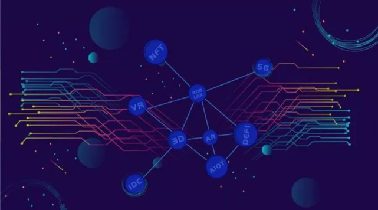
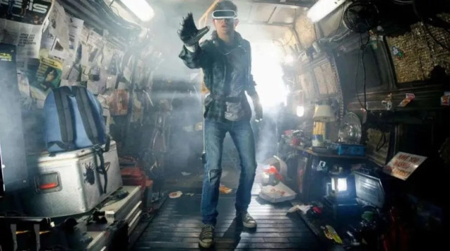
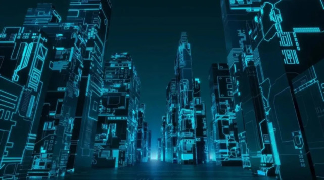

## 元宇宙——现实与虚拟世界的时光机

如果问当下最火的概念是什么，那必然是元宇宙。

元宇宙到底有多火，对互联网行业有多重要？从 Facebook 创始人兼首席执行官马克·扎克伯格近日的一段采访中可窥知一二。在 The Verge 的专访里，这家世界最大的社交平台掌舵者表示：希望在未来用 5 年左右的时间，将 Facebook 打造为一家元宇宙公司。

元宇宙概念的火爆还体现在，今年的 ChinaJoy 上有关元宇宙的发言屡见报端、连芯片巨头英伟达也忍不住“蹭热点”，等等。

那么问题来了，元宇宙到底是什么？我们离它还有多远？

什么是元宇宙？

元宇宙的英语是 Metaverse，Meta 表示“超越”、“元”， verse 表示“宇宙 universe”。这个概念最早出现在 1992 年尼尔·斯蒂芬森的科幻小说《雪崩》当中，小说描绘了一个平行于现实世界的虚拟数字世界，在这里，人们用数字化身来控制并相互竞争以提高自己的地位，到现在看来，描述的还是超前的未来世界。

2018 年斯皮尔伯格导演的科幻电影《头号玩家》，被认为是目前最符合《雪崩》中描述的“元宇宙”形态。在电影中，男主角带上 VR 头盔后，瞬间就能进入自己设计的另一个极其逼真的虚拟游戏世界——“绿洲”（Oasis）。在《头号玩家》设定的“绿洲”场景里，有一个完整运行的虚拟社会形态，包含各行各业的无数数字内容、数字产品等，虚拟人格可以在其中进行价值交换。

如果说这些“元宇宙”都还存在于小说和电影中，那么在今年 3 月被称作“元宇宙”第一股的 Roblox 成功在纽交所上市，则似乎意味着这个虚拟世界想走向现实。

在 Roblox 的招股书里，对元宇宙有更具体的描述，这家公司认为一个真正的元宇宙产品应该拥有 8 个属性：身份、朋友、沉浸感、低延迟、多元化、随地、经济系统和文明。

具体属性解释如下：

•身份：拥有一个虚拟身份，无论与现实身份有没有相关性。

•朋友：在元宇宙当中拥有朋友，可以社交，无论在现实中是否认识。

•沉浸感：能够沉浸在元宇宙的体验当中，忽略其他的一切。

•低延迟：元宇宙中的一切都是同步发生的，没有异步性或延迟性。

•多元化：元宇宙提供多种丰富内容，包括玩法、道具、美术素材等。

•随地：可以使用任何设备登录元宇宙，随时随地沉浸其中。

•经济系统：与任何复杂的大型游戏一样，元宇宙应该有自己的经济系统。

•文明：元宇宙应该是一种虚拟的文明。

元宇宙的技术基础

元宇宙的建设与发展离不开强大的技术支持。而支持元宇宙的技术集群主要包括五个板块：

1. 网络和算力技术，包括空间定位算法、虚拟场景拟合、实时网络传输、GPU服务器、边缘计算，降低成本和网络拥堵；

2. 人工智能；

3. 电子游戏技术，支持游戏的程序代码和资源（图像、声音、动画）的游戏引擎；

4. 显示技术，VR/AR设备，持续迭代升级，虚拟沉浸现实体验阶梯，不断深化的感知交互；

5. 区块链技术，实现经济系统运行的稳定、高效，透明和确定性；

元宇宙需要强大的技术来支撑。而如今以上大部分的技术多数处于高速发展或者是萌芽期，距离实际落地应用还有一段的距离。例如区块链技术，从问世到如今只过了10多年，仍然是个相对不成熟的技术，而区块链技术能够实现与运行元宇宙中的经济系统。再来则是显示技术，如今的VR/AR技术相对不成熟，距离能够让人们完全沉浸在虚拟世界中还有很长的路需要走。

元宇宙的建设与发展将很大程度上促进或是加快相关技术的研发。Facebook旗下的VR/AR设备制造商Oculus的最新产品Oculus Quest 2销量持续超预期，点燃了市场对于元宇宙和虚拟现实的相关想象。

除了上述的技术之外，元宇宙以「硬技术」为基础，包括计算机、网络设备、集成电路、通信组件、新型显示系统、混合现实设备、精密自由曲面光学系统、高像素高清晰摄像头。元宇宙形成的产业链包括微纳加工、高端制造、高精度地图、光学制造等，例如衍射波导镜片、微显示和芯片制造以及相关的软件产业。最终，元宇宙的运行需要物理形态的能源。

元宇宙概念为何在今年爆发？

Roblox 对元宇宙概念的阐述虽然更加具体，但要素众多，每个要素背后，还有着一连串的解释。这也说明这一概念的模糊性。

然而这不妨碍元宇宙成为一个好的故事。Roblox3 月份上市后，其市值达到 400 亿美元，相比 1 年前 40 亿美元的估值暴涨了 10 倍。App Annie 发布的全球热门游戏收入排名显示，7 月 Roblox 继续蝉联冠军宝座。

恰恰是因为元宇宙概念目前没有一个简单、具体的定义，吸引互联网公司们进入这个赛道，以自己的方式和理解去塑造、定义元宇宙。

4 月中旬，全球知名的游戏公司 Epic Games 融资 10 亿美元用于“元宇宙”相关业务开发，创下“元宇宙”赛道最高融资纪录。5 月，苹果公司以 1 亿美元收购虚拟现实公司 NextVR，以增强其在娱乐和体育领域的 VR 实力。7 月 29 日，在 Facebook 的季度盈利数据发布后，马克·扎克伯格着重强调了“把 Facebook 转变为‘元宇宙’公司的雄心”，并激活虚拟社区计划 Horizon。8 月 12 日，英伟达自曝，在其 4 月举行的发布会上，CEO 黄仁勋的演讲中有 14 秒由数字合成的“假人”代为出镜，被网友认为是元宇宙的体现，但事实还相去甚远。

在国内，号称要打造全年龄段元宇宙世界的 MeteApp 公司，在 Roblox 上市后拿到了 SIG 海纳亚洲资本领投的 1 亿美元 C 轮融资。字节跳动对游戏引擎研发商、“中国版 Roblox”代码乾坤进行了近 1 亿人民币战略投资。

资本的追逐只是观察元宇宙的一个切片。冷静下来思考一个问题，为什么元宇宙会在 2021 年火爆？

在需求侧，疫情的发展不断蚕食减弱人们在物理世界的联系，也加速了数字世界的完善，人们在虚拟空间中留存和交互的时间更多，对虚拟世界的需求和服务更加开放和认可。而在技术侧，随着 VR/AR、5G、AI 等技术的发展，让曾经科幻小说中的场景一一实现，为元宇宙描绘出一个可见的触摸门槛的机会。

元宇宙给商业世界带来哪些机会？

有人非常看好元宇宙，将它称为“下一代互联网”。许多巨头也纷纷布局元宇宙，想做第一个吃螃蟹的人。而新的事物总是伴随着机遇与挑战。

元宇宙带来新的商业模式

Fortnite（堡垒之夜）提供了一个有趣的例子，公司放弃了他们的知识产权控制权。在Fortnite引入一些当下火热角色皮肤后，许多玩家立刻登录游戏，花费游戏币来购买皮肤。而玩家可以通过完成任务，升级打怪，得到一些稀有的虚拟物品。而如果这些皮肤是限量版，再有其他的稀有物品加持的话，实际上玩家可以通过Fortnite运营的二级市场进行交易，而Fortnite在从中收取费用，那么收益将无可估量。

如今的元宇宙雏形都没有二级市场，但我们可以从NFT平台得到启发，而这当中NBA Top Shot就是一个例子。NBA官方将精彩片段或是球星卡打包成NFT形式出售。初始售价一般上不高，大约几十美元。然而之后每一次转手，平台都会从中抽取一定比例的费用。此商业模式为NBA带来了一笔可观的收入。

Fortnite放弃了其公司的知识产权控制权，许多公司都觉得不可思议。对于漫威（Marvel Comics）、DC（DC Comics）、NFL、耐克等IP大厂来说，放弃控制权对他们来说都是难以接受的。但放弃了控制权，未来从交易中抽取一定比例的费用可以说是开启了一种新的商业模式。

元宇宙是个游戏+社交的虚拟世界。

如果人们可以在虚拟世界中将自己打扮成心仪的人物，那么相信有许多人都愿意掏钱买体验。如果引入稀有皮肤，让人们破解任务获得稀有道具加持的话，那么用户在元宇宙所花费的时间必然会大幅增长。而后打造一个交易市场，让人们能够交易皮肤道具等。这样一来就会产生可观的交易费用，就好比金融市场的做市商。

扎克伯格在财报电话会议上表示：“我们的商业模式不会主要围绕试图以高价出售设备或类似的东西，因为我们的使命是为尽可能多的人提供服务。因此，我们希望让我们所做的一切尽可能负担得起，以便尽可能多的人能够参与其中，然后在其中扩大数字经济的规模。”广告仍将发挥作用，但 Facebook 也会专注于虚拟商品的销售。扎克伯格表示，元宇宙中的广告将是 Facebook 从元宇宙中获利的战略的“重要组成部分”，但他更看好数字世界的商业。

可见，Facebook也是看好元宇宙未来的商业模式而积极布局。或许，Facebook真的转型成元宇宙公司的话，其公司价值会以可怕的速度增长。

拉近品牌与用户之间的距离

Z世代，特指在1990年代末至2010年代前期出生的人。Z世代受到互联网、即时通讯、简讯、MP3播放器、手机、智能手机、平板电脑等科技产物影响很大。他们可说是第一个自小同时生活在电子虚拟与现实世界的原生世代。由科技发展形塑的社群关系与价值观深深影响了此世代的自我认同，对于新鲜事物接受度大。

传统品牌如Gucci等知名品牌为了保持竞争力，吸引Z世代成为其顾客群体是其重要任务。LV此前推出了NFT游戏，让玩家可以闯关收集限量NFT的同时也了解LV的历史，这对于传统品牌来说是个破圈。许多奢侈品牌都放下身段，推出自家NFT与Z世代的顾客互动。

以往的商家与顾客互动模式是，商家推出符合当下趋势新品，顾客到店里面购买商品。而NFT和元宇宙则打破了过往商家与顾客的旧有互动模式。例如，用户可以在元宇宙中购买品牌推出的服装，进一步改造或“加工”成自己喜欢的样子。厂商觉得客户的创意不错也可以进一步合作推出相关产品。

以往的互动方式都受限于地理上的限制。有的国家整体经济不发达，那么自然品牌的门店就会少一些；而较发达的地区就会门店多一些。然而在元宇宙中，只需要有网络就可以与顾客产生互动。这样一来也能拓展客户的群体。例如以往购买NBA的周边只能去相关门店，当中以美国为主。而如今只需要网络上NBA Top Shot官网就能购买官方认证的精彩片段周边。

消费者有更好的虚拟体验

如今人们在虚拟世界中花费更多的时间，而元宇宙将进一步提升人们的虚拟体验。目前人们线上购物只能上网看图片，影片或是物品参数来进行选择，但如服装类的物品不能试穿。而在元宇宙当中，人们可以利用虚拟现实的技术来仿真试穿的效果等，让人们进一步评估此服装适不适合自己。

自从2020年疫情的爆发，线上办公逐渐成为一个趋势，打破了人们上班的地理限制。而元宇宙将能够加强线上办公的体验感。2021年8月，Facebook推出了Horizon Workrooms平台公测版。

使用 Oculus Quest 2 设备登录，在家工作的人们可以通过虚拟方式参加会议，并且享受身处同一个房间的感觉。在此平台中可以最多 16 人可以一起在一个工作室中，而另外 34 人可以在不戴AR/VR设备的情况下通过视频通话加入。而会议室的面板则可以实时连接我们的计算机屏幕进行展示。

扎克伯格曾说：它基本上让你有机会与他人坐在一张桌子旁工作，进行头脑风暴。对于无法通过虚拟现实参与的人，他们可以进行视频会议。这是一次非常棒的体验，你会觉得你真的和你的同事在一起。

除了线上办公之外，此应用场景也可推广至社交。如今我们的线上社交主要是依靠视频（互动性最高）或是冰冷冷的字体。而元宇宙能够提高人们的社交体验感。除了语言之外，我们也可以观察到其他人的肢体语言等细节。这让用户有着更高的参与感。

在应用侧也可以归纳为三大可见趋势。

趋势三：体验升级。传媒大师麦克卢汉曾经说过：媒介是人类感官的延伸。随着信息技术的迭代，我们的五感（视觉、听觉、触觉、味觉、感觉）将被逐一的数字化，信息的维度也在逐步增加，使得数字内容不断的逼近现实的感官体验，更具有真实沉浸感。

同时，人机交互也从间接交互（主要通过按钮、鼠标键盘等控制机器），到AR/VR媒介时代，我们可以通过手势、声音、体感（包括肢体运动、眼球动作和面部表情等）与机器进行更贴近自然的直接交互；随着脑机接口技术的成熟，我们甚至可以直接用脑电波控制机器。总体而言，我们的体验会越来越好，也会越来越趋近真实。

趋势四：决策升级。随着信息体量和维度的增加（数据生产要素），以及人们分析信息的工具越来越智能（AI生产力），两者叠加将促进人们决策更加精准、可预测性也会越来越高，可以更加高效的指导我们生产生活的方方面面。

趋势五：商业升级。元宇宙本质上仍是互联网，只是内容呈现更加接近现实形态。

我们知道，人与人、人与信息、人与商品/服务的连接与交互是互联网商业化的基础。过去从PC互联网到移动互联网，随着信息入口发生改变，人与人、人与信息、人与商品/服务的连接关系也将发生改变，我们称之为“场景革命”。

这些关系或场景发生变化，承载在这些连接之上的商业形态也将进行新一轮的颠覆式创新。那么，今天元宇宙的发展趋势下，我们的社交、我们的商务，我们的信息获取方式，以及内容生产和消费都将会涌现出全新的模式。