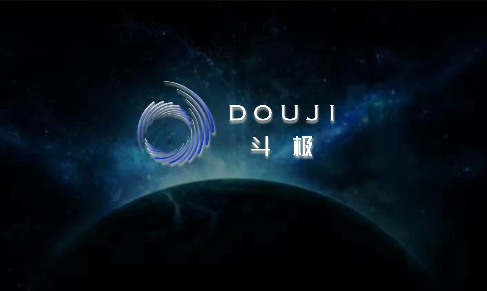

## 元宇宙行业深度研究：背景、空间、选择

### 1 背景：元宇宙大幕拉开，行情源于产业剧变

**1.1 元宇宙：平行于现实世界的虚拟世界**

元宇宙（Metaverse）可以笼统地理解为一个平行于现实世界的虚拟世界，现实中人们可以做到的事，都可以在元宇宙中实现。 “元宇宙”强调的是生态的完整性和用户的主观能动性。也就是说，用户在“元宇宙”中不只是一个被动的玩家，而可以像现实生活一样，按个 人需求去社交、玩耍、创造和交易等。 《头号玩家》中的虚拟世界oasis被普遍认为是元宇宙的最终形态代表。

**1.2 元宇宙产业链分布及玩家图谱**

元宇宙需要各项技术的支撑，可以 将元宇宙产业链分为七个层次： 1）体验层，是我们实际参与的社交、游戏、现场音乐等非物质化的 体验。 2）发现层，是人们了解到体验层 的途径，包括各种应用商店等。 3）创作者经济层，帮助创作者制作并将成果货币化，包括设计工具 、货币化技术等。 4）空间计算层，3D化层，包括3D 引擎、VR/AR/XR等。 5）去中心化层，包括边缘计算、 区块链等帮助生态系统构建分布式 架构。 6）人机交互层，指硬件层，包括 手机、智能眼镜等可穿戴设备。 7）基础设施层，包括网络设施与芯片等。

**1.3 核心矛盾在边界：元宇宙≠游戏**

元宇宙是一个借助VR等技术实现的虚拟世界，可以包含各种场景。 元宇宙≠游戏，游戏本身具有任务性/目的性，而元宇宙本身虽然可以包括类似游戏 的目标，部分场景游戏化，但是元宇宙本身不是游戏，也不围绕特定目标。 可实现场景：元宇宙向人们提供可以活出另一种人生的虚拟世界，在这个世界中， 有完整运行世界体系。 人们可以进行多种场景的日常活动，除游戏外，可以进行社交活动、购物、学术活 动、休闲娱乐活动，甚至可以通过跑步机等外接设备在元宇宙中运动。

### 2 空间： TMT“生态级”主线，产业增量在哪里？

**2.1 A股TMT新的“生态级”主线，细分四大产业环节**

在此前的系列报告中，我们明确指出，元宇宙是继“鸿蒙”之后，A股TMT领域的又一个生态级主线。 相较而言，鸿蒙是国产基础软件新的发动机，其商业化能力有望引领国产软件行业建立新的软件生态。 而以“元宇宙”为代表的“生态技术创新”趋势也不容忽视，这一颠覆式创新有望孕育新的万亿级生态蓝图。

拆分产业链来看，我们将元宇宙的产业创新环节归纳为以下四方面： 1、底层架构，如区块链、NFT、虚拟货币等 2、后端基建，如5G、GPU、云化、AI+等 3、前端设备，如AR/VR、智能可穿戴等 4、场景内容，如沉浸式娱乐（游戏）、虚拟人营销、军工应用（地图 & 仿真）、智慧城市（孪生）、工业/教育/医疗/司法等垂类应用 要支撑四大产业环节，还需要多类计算机软硬件的技术创新： “元宇宙” 的产业落地过程需要N多类计算机前沿技术的配合与支撑： 涉及5G、SaaS、区块链、计算机视觉、智能语音语义、深度学习、智能终端、2B/2C场景know-how及海量数据。（报告来源：未来智库）

**2.2 分支空间测算 1：底层架构，如区块链 & NFT**

元宇宙是接近真实的沉浸式虚拟世界，构建对应的经济系统至关重要。 我们认为，此前的普通虚拟世界（网游、社区等）一直以来都被当做普通 娱乐工具，而非真正的“平行世界”，主因在于： 这类虚拟世界的资产无法顺畅在现实中流通，即便玩家付出全部精力成为 虚拟世界的“赢家”，大概率也无法改变其在现实中的地位； 这类虚拟世界中玩家的命运不掌握在自己手中，一旦运营商关闭了“世界” ，则玩家一切资产、成就清零。 而我们认为，区块链的出现与成熟将完美解决了上述两点，让元宇宙完成 底层架构的进化，而这正是当前被市场所忽视的一个产业环节：

区块链可以在元宇宙中创造一个完整运转且链接现实世界的经济系统，玩家的资产可以顺利和现实打通， 区块链完全去中性化，不受单一方控制，玩家可以持续地投入资源。 《堡垒之夜》创造者“虚拟引擎之父” Tim Sweeney：区块链技术和NFT是 通向新兴的元宇宙（虚拟世界）的“最合理的途径”。 其中NFT全称Non-Fungible Token，即非同质化代币（比特币等数字货币 为同质化代币），是区块链框架下代表数字资产的唯一加密货币令牌，未 来将是元宇宙的经济基石。 NFT可与实体资产一样买卖，保证了元宇宙中基础资产的有效确权。

**2.3 分支空间测算 2：后端基建，如5G、GPU、云、AI+等**

除了框架与协议，底层技术支撑还包括5G、GPU、云计算、AI、算力 与网络等涵盖软硬件的基础设施： 软件定义一切的大趋势下，5G、云计算、AI技术等软件层面核心技术 将成为关键，带动数据量/精细度提升助推元宇宙落地。 根据中国信通院报告，当前虚拟现实存在单机智能与网联云控两条技术 路径，前者主要聚焦近眼显示、感知交互等领域，后者专注内容上云后的流媒体服务服务。判断未来的元宇宙框架中，两者将在5G基建的基 础上有机融合，AI+ & 云化共振触发产业跃升。

### 3 选择： 主题还是前沿，新方向看“虚拟人”

**3.1 现阶段预期差的场景——虚拟人**

近期，市场涌现诸多元宇宙创新应用方向，包括但不限于虚拟人、军工应用（地图 & 仿真）、智慧城市（孪生）、工业/教育/医疗/司法等 垂类应用。结合产业落地进程，我们判断虚拟人是元宇宙当前的预期差赛道（产业进展超预期）。 定义：虚拟人指由 CG 技术构建、以代码形式运行的拟人化形象。 特征：1）拥有人的外观及性格特征；2）拥有通过语言、表情或肢体动作表达的能力；3）拥有识别外界环境、与人交流互动的能力。

**3.2 四阶段发展：萌芽，启蒙于动画虚拟人**

虚拟人产业经历四个发展阶段：萌芽阶段、起步阶段、探索阶段、成长阶段 第一阶段（萌芽阶段）：虚拟人概念起源于20世纪80年代的日本，早期使用2D、3D动画的形式展现虚拟人形象。1）1982年，动画作品《超 时空要塞》中的女主角林明美凭借动人的歌声与纯真的人设走红，动画制作方顺势以林明美的名义将剧中插曲按照偶像专辑进行发售，林明 美因此成为全球首个虚拟歌手，也是全球首个虚拟人。2）1985年，由英国人George Stone等人创作的一个名为Max Headroom的虚拟人物 ，曾参演了一部电影，并拍摄了数支广告。

**3.3 虚拟数字人产业链：上/中/下游拆分**

虚拟人——全程虚拟数字人，产业链拆分如下： 上游：制作内容类、工具类和IP策划类公司 ， 中游：虚拟数字人厂商 ， 下游：应用领域覆盖娱乐、文旅、金融、教育、医疗、政务等。

### 4 投资分析

**4.1 虚拟人主播& AI算法龙头：科大讯飞**

科大讯飞股份有限公司成立于1999年，是亚太地区知名的智能语音和人工智能上市企业。 自成立以来，公司深耕语音及语言、自然语言理解、机器学习推理及自主学习等核心技术研究并保持了国际前沿技术水平；积极推动人工 智能产品研发和行业应用落地。 生态框架来看，目前公司专注人工智能产业生态，形成三个同心圆：1）核心层：围绕“讯飞超脑”，公司的教育BG、智慧城市BG、消费者 BG、智慧政法BG、智慧医疗BU、智能服务BU、智能汽车BU、运营商BU、工业智能业务部等共同构筑科大讯飞人工智能产业生态的核心 层。2）探索层：在探索性方向，鼓励内部实施创业机制和战略合作机制，通过资本纽带的形式推动人工智能产业化。3）开发层：围绕人 工智能核心开发平台，公司为创新创业者提供技术和数据支持，帮助创新创业者在各应用领域进行业务创新探索，推动整个产业生态构建。

**4.2 其他受益公司：虚拟人营销龙头蓝色光标**

三大布局：虚拟直播、虚拟形象、虚拟空间。 虚拟直播：和阿里达摩院合作，7*24小时智能直播间，主要解决直播的开播难、成本难控制、效果无法保证的痛点。 虚拟形象：提供企业名人虚拟形象，包括Q版、二次元、偏写实、超写实。 虚拟空间：空间复刻(工期短，还原度高)+空间自建(未来感强，时间周期长) 蓝色光标2020年营收突破400亿元。 2020年公司实现营业收入405.27亿元，营收增速为44.2%；实现归母净利润7.24亿元，增速为1.9%。 21Q3收入314.83 亿元，增速为9.1%，归母净利5.46亿元，增速为-11.7%。

**4.3 其他受益公司：数字版权&数字人龙头捷成股份（传媒组覆盖）**

捷成股份以提供专业音视频解决方案产品起家，通过外延式收购布局影视制作及版权运营等内容领域。 2021 年 11 月，公司完成资产剥离，进一步聚焦影视版权主业， 同时持续探索虚拟人、虚拟平台等元宇宙业态。 在实时数字人和快速动画 制作领域处于领先水平。目前公司已经签了一些明星 包括奥运明星的虚拟IP形象，由明星的虚拟IP形象带 来的代 言和演唱会等收入公司将与明星五五分成。

聚焦版权主业，探索元宇宙业态，实时数字人或是新方向。 2006-2013年，以音视频业务登陆 A 股；2014-2017年，外延并购布局内容业务；2018-2020年，影视资产减值，聚焦版权主业 ， 2021 年初至今，剥离影视资产，探索元宇宙业态:2021 年 5 月-11 月，经过多 轮盘点，转让子公司捷成君盛剥离影视业务及部分传统音视频 业务，包括中视精彩、 瑞吉祥、冠华荣信、极地信息、世奇影业等多家公司，保留了部分元宇宙业务相关资产。公司未来将积极引入战略 投资者，优化股东结构，改善公司治理结构，专注于以 华视网聚为核心的影视版权业务，携子公司世优科技积极探索元宇宙业态。