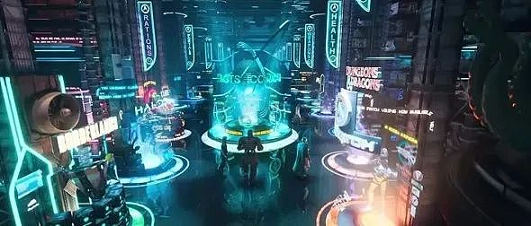
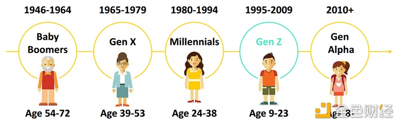

## 元宇宙的八大典型应用场景

新年伊始，智纲智库开始着手研究元宇宙和数字技术发展对城市、企业和个人的影响。

面对“万事皆可元宇宙”的资本热度，智库分别从城市企业战略、新型基础设施、应用场景探索三个角度描述今日元宇宙和数字技术的发展态势，探索中国语境下的元宇宙发展之路。

2021年，元宇宙一词突然出现在大众的视野，在还未深入了解元宇宙究竟是什么，我们发现大众已经急于为这一新流行词冠上了定义。

有的人说这就是“虚拟世界”的畅想，有的人说这就是“《头号玩家》的体验”也有人说这就是“一场新时代的数字变革”。

其实，我们对于元宇宙并不陌生，陌生的只不过是一个名字，在很久之前它已经以神话的方式渗入在我们的生活中。在红楼梦中贾宝玉进入了太虚幻境，在聊斋里书生进入画中的世外桃源，在之前特别火的动漫《哪吒》中，你也看到了哪吒进入山河社稷图获取宝物。

这些不同的角色进入了完全区别于现实的世界，在这些幻境里可以看到并体验一切美好的事物。在20世纪90年代初，钱学森就对虚拟现实与“元宇宙”有过展望，为其起了个颇有意境的名字—“灵境”，并透过虚拟现实技术的产生和发展，预见到人机深度结合将对人类社会带来的深层变革。

如今，随着数字化发展，元宇宙以一种全新的姿态出现，它告诉我们元宇宙并不是只以视觉感出现在书本上、电影上，它将用虚拟共生以真实的体验感为我们开启一个全新的数字时代。

在这个数字世界的崭新阶段，各种技术都将出现新的突破，而这些技术创新的背后，是多元化的消费端场景需求在推动。

就元宇宙的相关领域来说，中国拥有最广泛的应用场景和全球最大的应用市场，海量的应用需求将迅猛推进技术革新，**从这一角度来说，我们率先研究元宇宙的应用场景至关重要。**

**智纲智库认为元宇宙是数字化的最终形态，将成为集娱乐、社交、学习、生产、生活为一体的数字世界，与现实世界紧密融合。**

那么这种虚实共生的元宇宙应用场景究竟是什么样？基于我们对于元宇宙的研究，本文将从**消费、娱乐、文旅、教育、产业、健康、办公、居住**八个典型场景来进行分析和畅想。

其中，智纲智库认为在消费、娱乐、文旅、和教育领域，将凭借巨大的市场容量和包容性，促使需求极快地推动应用初步落地，并在完善中逐步迭代，互联网“小步快跑、快速迭代”的发展模式也将继续发生于该场景下的元宇宙中。

而产业、健康、办公和居住等领域，由于产业链复杂、技术阶段瓶颈等多重因素，还需要通过科技发展、制度完善等层面实现推动和突破。

## **元宇宙消费场景**

- **Z世代是元宇宙原住民，会形成与“互联网移民”完全不同的消费模式**

元宇宙作为一个新互联网词汇，它的消费主力人群一定是伴随着互联网成长的Z世代。

互联网是他们生活的必需品，超过40%的Z世代每天上网时间超过6小时，他们线下是社交恐惧症，线上是社交牛逼症。

独生子女出生的他们，对于自我需求的满足以及自我认同的需求非常强，由于所处时代衣食无忧，所以他们对于精神层面的追求远高于物质层面的追求。

他们是主动寻求消费升级、推崇个性消费的群体，它们具备前卫、新潮、追求新鲜感的消费意识。数字化消费对于他们来说可以称得上简单易懂，得心应手。

- **元宇宙消费场景推动虚拟货币流通，线下消费增加线上收入**

元宇宙是一个全新社会存在的形态，将人类社会的边界从现实扩充到虚拟，再结合虚拟打造成为一个全新的数字世界，这个数字世界与现实世界的关系是平行存在又相互贯通。

那么如何实现两个世界的货币流通？

这就推出了虚拟货币的存在。在线下的消费可以获得元宇宙的虚拟货币，这种虚拟货币可以购买数字藏品、数字音乐、数字游戏，原来消费也有收入。

- **线上与线下的消费联动，推动新消费时代的变革**

元宇宙的存在并不是减少线下的消费性，它是结合线上与线下实现虚实共生的消费，推动传统商业实现新消费时代的变革，更大幅度地增加消费者的体验性，真实的做到沉浸式、体验式。

在澳大利亚墨尔本的一所艺术酒店利用班克斯的作品开展了一场非常有意思的元宇宙偷盗活动，在酒店展出班克斯的名画《禁止玩球》，这幅画价值15000美元，只要登记入住酒店者便可成为允许偷盗者。

这个酒店成为了被允许偷盗的元宇宙空间，很多人都因为想尝试“允许偷盗”这一行为而纷纷前往，而偷盗目标和线索自然不易获取，只要在酒店消费，便可获取新线索，在获得住客的同意后，酒店还会在社交媒体账号上公布住客偷盗画的监控录像，被镜头捕捉到的人也很开心的把这件事分析在自己的社交媒体账号。这个酒店活动最后还获得了克里奥互动媒体广告铜奖和戛纳公关金狮奖。

**消费场景畅想**

欢迎来到首家元宇宙消费空间，进入空间即开始你的元宇宙之旅。

温情提示：在这个空间里请先创建您的角色身份，角色身份同步线上空间，您在线下所完成的任务和消费将实时传送到线上空间获得虚拟货币，虚拟货币可在您的元宇宙空间用来购买一切数字用品和建设自己的元宇宙空间。

这座元宇宙消费空间无论从外形还是业态内容都打破了人们对于所认知的现实空间界限，可以有选择地自由进入不受现实因素限制的虚拟空间，利用VR/AR/MR、数字孪生、5G、云计算、AI人工只能、NFT、区块链等新一代技术，实现四季体感随意切换，致力于实现人们在虚拟世界中视觉、体感进行全方位连接。

首先进入空间创建身份，开始逛游模式。采取多个剧本模式，消费的同时你也是神秘的“福尔摩斯”，多个NPC助力游戏精彩瞬间。

这里有时尚魔境，消费空间不再设立试衣间，在这里一面墙设有多面魔镜，直接在镜面选择你喜欢的衣服样型，根据个人的体貌特征，直接采取AR试穿。消费后这款衣服的NFT同款直接录入到你的元宇宙空间，你的线上虚拟人物已经穿在身上。

在这里，甚至可以邀请你的异地朋友一起线上逛街购物品尝美食玩游戏，真正做到无空间界限社交。

由消费和完成游戏任务所得的虚拟货币可以在自己的元宇宙空间里购买房屋、车子、宠物。

## **元宇宙娱乐场景**

- **实现个人娱乐的极致沉浸式体验，重塑娱乐商业模式**

元宇宙中的娱乐游戏可以完全打破传统地理限制，实现场景瞬间切换、容纳无限用户容量和低成本沉浸式体验过程。

之前王菲的幻乐一场演唱会可谓刷爆网络，除了传统的直播，VR技术的运用让不在现场的人有了更加立体观看的机会。

