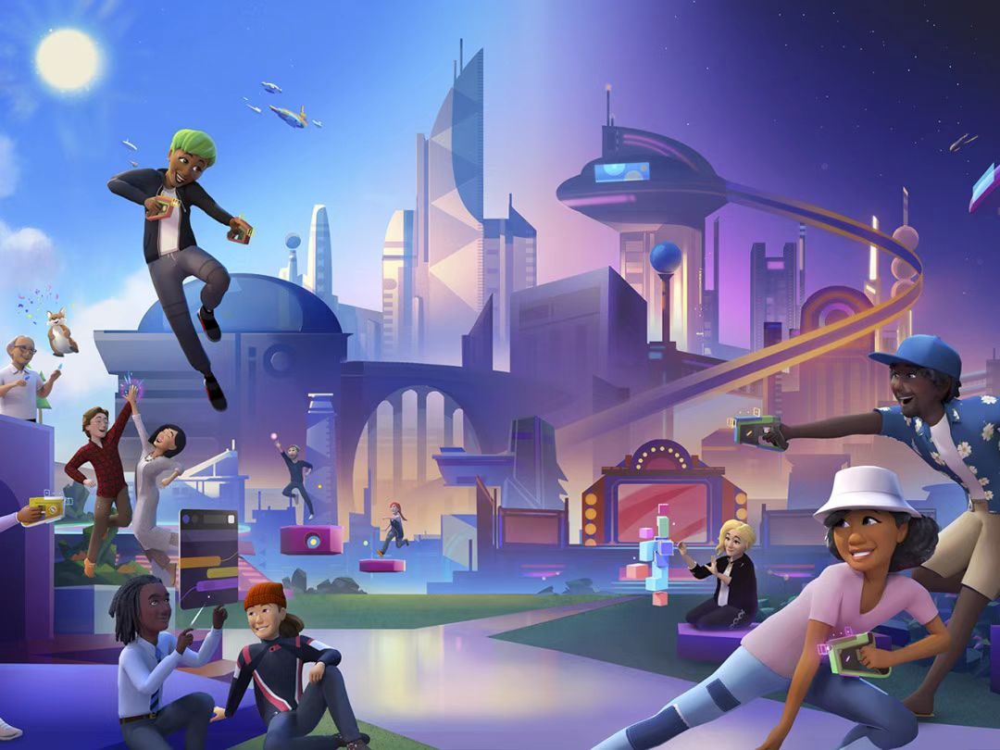
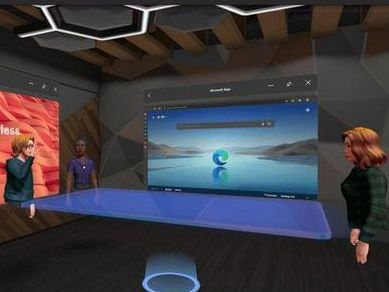

## 元宇宙的生态圈

自元宇宙大火以来，大量互联网企业以及资本涌入这个全新的赛道，在过去一年多的时间里，元宇宙已经形成了一个初具规模的市场，在多个领域都能看见元宇宙的身影。

元宇宙与社交

社交领域可以说是元宇宙最初的应用场景之一。通过对现实场景的复制和延伸，元宇宙成为了传统社交在互联网中的一个虚拟空间载体。通常来说，元宇宙通过构建出社交角色、场景以及社交空间，让社交与数字世界更好地融合在一起。
————————————————

元宇宙与游戏

网络游戏被很多人认为是最接近元宇宙的一个领域，近年来，游戏产业处于稳定增长状态。元宇宙通过高度沉浸的特性，丰富了游戏的体验感。

另一方面，游戏的元宇宙化，也让虚拟世界和现实世界的融合更近一步，仅在元宇宙发展的初期，我们就可以从游戏中看见一个元宇宙雏形。

元宇宙与虚拟人

元宇宙对数字身份的高需求，也带动了虚拟人产业的快速增长。元宇宙中的虚拟人主要分为两种类型，一是由用户控制的虚拟化身，能够成为用户在数字世界进行工作、学习、娱乐的承载体；二是数字世界的原生“数字人”，利用人工智能等技术让它们能够与人自主互动，在元宇宙中担任虚拟偶像、虚拟导游等角色，甚至还能担任企业中的虚拟员工，形成一个数字化的社会生态。

元宇宙与金融

金融领域一直是走在时代发展的前端，在数字时代，金融也是数字化应用最为广泛的一个行业。元宇宙的出现，将互联网、5G、人工智能、区块链等信息技融为一体，成为了金融领域一个全新的强大助力。

元宇宙将数字内容资产化的独特优势，让金融业核心的资金流通有了新的增长点。另外，元宇宙的去中心化，更是打破了金融行业越发严重的同质化趋势，从消费、场景应用等多方面全面提升金融业的动力。

元宇宙与旅游

旅游业对地理、时节等因素的依赖让它在发展到一定规模之后就很难得到更进一步的提升。元宇宙利用 XR 相关技术，将处于现实中的景点转移到虚拟世界当中，摆脱时间和空间的限制，为旅游者们打造出了一个“平行世界”般的旅游体验。
————————————————

**元宇宙与教育**

元宇宙能够打造沉浸式的全景教学，将很多在现实中无法实现或有危险隐患的教学，通过虚拟的场景模拟展现在学生面前，增强学生的学习体验。当前已经有一批国内的教育机构在尝试打造 VR 元宇宙智慧课堂等项目。元宇宙对教育行业的渗透，将会让教育的方式得到全新的改变。

其他更多

元宇宙是一个拥有十分丰富内涵的新赛道，它也在许多领域发挥着强大的推动作用。比如基础底层技术的区块链、云计算、人工智能、物联网、5G/6G 等；设备终端入口的芯片、光学材料、通讯、显示、虚拟现实等；以及交通、农业、工业、文娱、司法、医疗等更多的应用场景。这些都充分展现出来元宇宙的强大潜力，元宇宙的生态圈也正随着进一步的发展在不断成长和扩大。
————————————————

