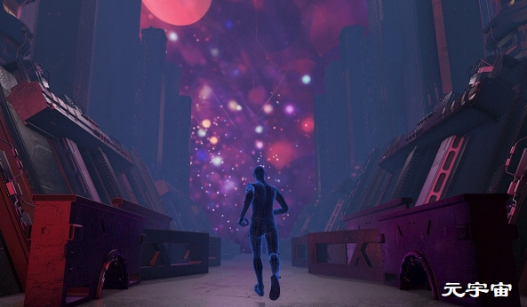

## 元宇宙：未来的前沿阵地

数字化沉浸式3D体验为各品牌带来又一个良机——人们利用数字头像或化身就能完成会面和交易 市场正在成型。 2021年，评论人士认为，在类元宇宙的环境下完成交易的市场总额约达1.3万亿美元。 其中约5860亿美元来自广告，4750亿来自社交商务，940亿来自数字活动。 预计未来六年的平均年增长率可以达到44%。 

充满创造力和远见的机会不胜枚举。 受众呈现多元化，且能体现出忠诚。 人们已经意识到了新的收入来源。 可持续性消费是一个极具吸引力的主张（但不要忽视这些数据的碳成本）。 友情提示：真实为王。 如果一个价值主张在现实世界就站不住脚，那它到了数字化世界也够呛。

在营销人员看来，激动人心的时代即将来临。 WPP新兴技术部副总裁安迪·胡德（Andy Hood）这样讲道：“任何新媒体的初期阶段都是我们最大程度地发挥影响力和想象力，并在塑造未来方面真正大有可为的时候。”

然而，关于元数据的定义仍然五花八门，WPP的数据和人工智能负责人迪·梅泽（Di Mayze）也承认这一点。 “但我们相信，等到2032年，它将成长一个稳固持久的虚拟环境，同时潜移默化地改善和扩大我们的日常生活，”她说道： “也就是说，人们不用有意‘进入’元宇宙来体验，他们的虚拟世界和现实世界会交织在一起，无论社交还是工作。”

**元宇宙不属于什么**

元宇宙是什么？这个定义我们仍然纠缠不清，但我们至少可以先弄明白：元宇宙不属于什么。

有些虚拟现实体验简直酷毙，却不是元宇宙，而整个元宇宙也不是虚拟现实。 增强现实也是如此。 例如，Oculus Quest的《节奏光剑》（Beat Sabre）是一款非常酷的虚拟现实游戏，却不属于元宇宙体验。 同样，2700万人参加了特拉维斯·斯科特（Travis Scott）在堡垒之夜的演唱会，但几乎没有人佩戴头显。

相同道理，元宇宙的力量不会通过单个企业的愿景来实现。 我们今天视之为元宇宙领跑者的大型科技公司推出的活动，在规模和互联程度大得多的元宇宙中不过是沧海一粟。

甚至连一场革命都算不上。 元宇宙这个概念，已经孕育了约35年。 最终，随着自身的不断发展，元宇宙将完全以虚拟世界的面貌呈现出来——在虚拟现实中。 然而，作为现实，它仍有漫漫长路要走。

**我们认为基础已夯实**

我们认为元宇宙有四大支柱。 首先是虚拟世界。 虚拟世界，包括那些沉浸式模拟世界，可以服务于想象力所能触及的任何目的（从游戏，到友人见面，再到观看娱乐节目、购物、交易、工作等等）。 以虚拟现实方式访问虚拟世界，可以享受最佳体验效果，但也可以通过手机、平板电脑和笔记本电脑访问——而且它们仍是主流。

通过AR/VR头显交付的增强现实，乃是我们的第二大支柱，它在虚拟世界和现实世界之间架设了一座桥梁。 分析师和投资商对于头显市场的热情明显高涨。 原因之一便是技术进步所涉及的范围，另外也因为AR/VR头显能够改变医学、教育和工作场所——元宇宙绝不仅仅是游戏机。 颠覆性革新头显开发商也有望占据一席之地，以更低的价格提供更佳水准。

第三大支柱是非同质化代币（NFT），这种代币已经在区块链上实现了交易。 非同质化代币属于可验证数字资产，通过稀缺性产生价值。 我们都听说过关于非同质化代币可收藏艺术品的大肆炒作，却不知道它们在区块链驱动下还有更广泛的用途。

第四大支柱便是区块链本身。 区块链其实是一个分布式数字账本，旨在记录交易、跟踪资产，并为非同质化代币、加密货币和DAO（“去中心化自治组织”的英文首字母缩写词，一种基于代码的社区或公司，但不是真正的公司）创建基层去中心化基础设施。

区块链将允许消费者在多个数字化世界中保持身份一致，同时实现元宇宙内购买的可迁移和可转移。

**总有难言之隐**

或许，这里说的难言之隐，正是人们构建共同标准所需要解决的。 品牌和数字头像或化身将如何在虚拟世界之间转换？ 知识产权问题也亟待解决。 元宇宙对品牌保护、版权、商标等意味着什么？ 法规、协议及一系列公认原则和行为也有待完善。

当然，人们对于元宇宙互联世界中安全和隐私的顾虑依然存在。 的确，在元宇宙中，身份的意义和外观究竟是什么样子？ 此外，还有围绕用户包容性和可访问性的问题，反社会行为更不必说——数字化环境呈现出一种特别难以监管和获得安全保障的态势。

然而，元宇宙却是创意转变的全新沃土。 市场营销人员需要经历一段调整期，以了解如何开发自身战略、如何将自己的品牌从现实世界转化为虚拟世界、如何在元宇宙中产生价值、如何实现货币化，以及如何降低风险。

还需要做出创意决策：虚拟体验看上去和听上去应该是什么样子？它应该如何促进贸易发展？ 它将如何深化消费者关系？虚拟体验将如何被激活？ 接下来会有一大堆内容问题。 需要营造生动体验，需要构建故事，需要创建资产，同时需要处理与现实世界的联系。 所有这些都将取决于技术及其与现有平台和基础设施的融合程度。

现在谈这些可能为时过早，但我们相信，通过将精彩绝伦的故事讲述、创造性技能、通讯技术、新硬件和普化天才融合在一起，真正的创意转变未来可期。