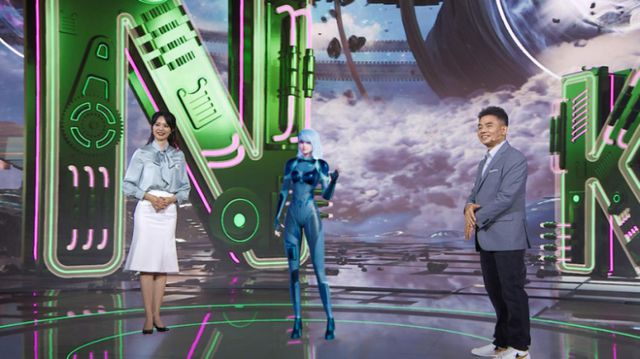

## 元宇宙成为市场的热门词汇

近两年，元宇宙成为市场的热门词汇，各种虚拟场景、AI设计等等层出不穷。音乐领域也不甘示弱，酷狗首位AI歌手正式上线，掀起AI内卷。

日前，酷狗携手杨超越在微博官宣了一项AI领域的合作，即以杨超越真人声音打造“超越AI”。作为酷狗首位AI歌手，“超越AI”已经正式上线。

据悉，“超越AI”所演唱的歌曲采用的是阿波罗声音引擎AI技术合成，能够高度复刻音频特点，合成逼真且富有表现力的声音。更惊喜的是，该技术还包括粤语歌声合成技术，属于行业首个。#我要上头条#

酷狗音乐称，未来还会有更多风格、特色的AI歌手陆续上线，这些AI歌手将集中在“超级订阅”功能里，相当方便。实际上，这一功能的上线，不仅使听众耳目一新，更让大家实现“你想听什么，AI歌手就唱什么”音乐自由。可以说，酷狗“超越AI”的出现既是技术领域的一大突破，也为音乐行业提供了更多想象空间。