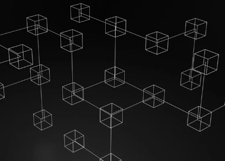

## 元宇宙对瑜伽意味着什么?

想想瑜伽世界是如何变得高度数字化的。我们通过社交媒体与世界各地的其他从业者联系，并通过在线平台上课或授课。我们通过网站订购瑜伽装备并使用信用卡付款，而无需实际接触我们所购买的东西。我们下载冥想应用程序并在手机上练习瑜伽序列，这实际上已成为我们双手的延伸。我们喜欢并分享帖子以表达我们的情感和支持。与此同时，公司收集了我们所有的数据，并让数以百万计的人向我们宣传更多的东西。

新景观

元宇宙是这种数字景观的演变。它代表了一种与个人拥有自己的内容和使用的服务的数字空间进行交互的新模式。Web3 或包含元节的保护伞仍处于早期开发阶段。创建于 2009 年。以太坊——允许创建 dApp、DAO 和 NFT 的区块链——于 2015 年发明。围绕 Web3 和元界的这些技术仍在不断涌现，但它们的发展速度很快。这些发展带来了很多希望，但也带来了很多问题。

它会对环境产生什么影响?早期采用者是否会出于投票目的控制大部分，从而回避该技术的民主承诺?我们想在虚拟现实中上瑜伽课吗?您能否将瑜伽序列作为 NFT 铸造到区块链上，授予特定系列姿势的所有权?

关于所有这些术语的含义以及它们如何适用于你，一个瑜伽士，有很多东西需要了解。以下是您可能听到的与加密、Web3 和区块链相关的术语表，以及它们如何影响您的实践和业务。

Web3：新的互联网

Web3 是一个在线生态系统，它是网络的新版本——字面意思是 Web 3.0。就像您今天使用 Google Chrome、Firefox 或 Opera 访问互联网一样，您将通过比特币、以太坊和Solana等区块链访问 Web3 。

它基于不依赖大科技的分散模型。使用 W3“网络浏览器”和“网站”的人拥有和控制区块链;大公司和企业集团没有。Web3 依靠博主、TikTokers、YouTuber 和其他创作者将他们的技能和艺术创意化，以扩大创作者经济。

作为创作者经济的真实示例，您可能熟悉“去化”一词，这是 YouTube 或其他流媒体平台禁止您的帐户获得广告收入的命令。在创作者经济中，您直接从与您的内容互动的人那里获得补偿，因此您的补偿不在其他人手中。

元界、加密、和区块链技术等流行语也属于 Web3 的范畴。Web3 可以理解为一所房子，而这些关键词是居住在里面并保持 Web3 站立的支柱。

Web 3 为瑜伽老师提供了接触国际观众的新途径。他们可以铸造 NFT 作为他们班级的准入证，并通过加密从世界各地的学生那里接收付款——无需任何国际费用。

元节：应用 Web3

元宇宙是个人在与数字世界互动时所体验到的。它通常通过虚拟现实 (VR) 耳机访问。数字世界是 Web3 中的一个“网站”。你戴上 VR 头显，通过它进入一个让人想起电子游戏的数字景观。随着时间的推移，您将发现自己进入了一个虚拟瑜伽工作室，而不是通过 Zoom 观看教练来上瑜伽课，在那里您可以看到其他人的化身练习教练所提示的姿势。已经在元宇宙中，您可以制作自己的化身，使用加密为您的化身购买瑜伽垫，甚至使用最新瑜伽装备的 NFT 为您的化身打扮。

虽然其中一些确切的功能仍在开发中，但一些 VR 硬件允许您从第一人称视角查看和控制您的手和脚，就像视频游戏一样。沉浸式虚拟现实 (IVR) 可以将您置于与您自己完全不同的身体和位置，因此您可以获得其他人的体验。作为一名瑜伽学生，即使您在家中使用自己的瑜伽垫，您也可以与其他学生一起上课。你主动操纵你的化身来复制你在家里的动作。作为一名教师，您会看到全班虚拟学生的姿势模仿他们的真人在家中所采取的身体姿势。

区块链

区块链是记录数据的连续系统。它将信息组存储在“块”上，例如有多少人注册了瑜伽课，形成了一个数字分类帐，从创建区块链的那一刻开始，一直持续下去。每次添加信息时，“链”都会继续。将区块链视为信息串。

该系统分布在计算机网络中，这意味着没有任何人或团体控制区块链。它之所以起作用，是因为成千上万(如果不是数百万)个人及其计算机运行节点(将它们视为小型服务器)，这些节点存储、分发和保护在区块链上发现的数据。区块链是开源的，可以构建。这意味着任何人都可以看到存储在每个区块中的信息，并可以创建以原始区块链为基础的新应用程序。但它不能被篡改，所以它是超级安全的。