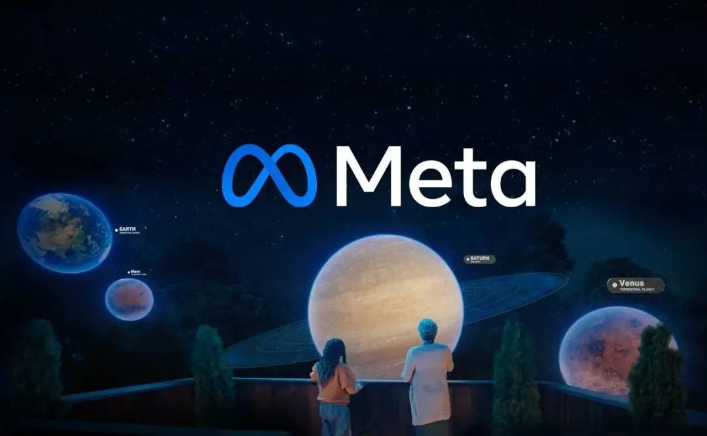

**元宇宙社交的场景应用盘点**

社交，指社会上人与人的交际往来，是人们运用一定的工具传递信息、交流思想，以达到某种目的的社会活动。社交必不可缺，其方式也在不断变化。传统的社交以面对面交流为主，在通信技术和互联网出现后，带来了电话、信息、视频等交流方式。而元宇宙下的社交方式既是对现实社交和互联网社交的延续，又从技术和社交场景上实现了多项突破。

社交本身是以人为主体的活动，“人”这一身份如何被演绎和展示是基础性问题。元宇宙在线创作游戏平台Roblox 提出了元宇宙的八个关键特征，其中“身份”被认为是构建起元宇宙完整生态的第一步。在元宇宙中，每个人都拥有一个“化身”，并在虚拟空间中探索和交流。“化身”不仅仅是一个头像，其和用户是对应的，代表了用户的个人形象。

在社交活动中，社交场所和场景的搭建也是不可或缺的，物理世界的社交场景受制于时间和空间的限制，网络社交虽然打破了这种限制，却失去了原本的空间感与沉浸感。本文对元宇宙社交的讨论范畴是广义的，包含元宇宙对现实社交场景的复制或延展。人们在物理世界的生活体验将在元宇宙中以二进制的方式被重新演绎，对镜像世界或者孪生世界的打造将成为承载社交活动的场景。

本文将从元宇宙与社交结合的实际案例出发，初探元宇宙与社交的结合路径。同时，零壹智库、01区块链、《陆家嘴》杂志、横琴数链数字金融研究院将联合推出《元宇宙场景应用探索报告》，目前报告正在案例征集中，报告将在2022第一届中国数字科技投融资峰会上发布，欢迎各类探索企业积极参与。

**一、元宇宙+社交案例分析**

**案例一：Meta“Horizon Worlds”**

背景：2021年12月10日消息，Meta在北美向公众开放了其虚拟现实平台“Horizon Worlds”（地平线世界）。Oculus虚拟现实头戴设备用户可以创建一个没有双腿的化身形象，在虚拟世界中游览，或者与其他用户的化身互动。

2022年2月，Meta公司CPO Chris Cox在一次虚拟会议中宣布，其虚拟现实平台Horizon Worlds的月活跃用户数首次达到30万，在三个月内增长了十倍。虽然目前只有拥有Oculus虚拟现实头戴设备用户可以使用，但Meta公司首席执行官马克·扎克伯格已经宣布，将在今年为该应用带来移动版本。

**社交功能**

在开始使用Horizon Worlds前，用户需要先创建没有双腿的化身，包括自定义身体、面部、头发和服，或者随机创建形象。在添加其他用户为好友后，你将可以向他们发送消息，并发送聚会请求。从社交功能上，目前平台支持拍摄和分享照片、与朋友前往各个空间旅行、举行疯狂的派对、游玩各种沉浸式游戏。

此前，Horizon worlds的一名女性玩家称遭遇“性骚扰”，其遭到几个男性玩家的言语骚扰，甚至有陌生用户试图在广场上“摸”自己的虚拟角色。为了保护虚拟化身免受骚扰，以及给用户创造更多个人空间，Horizon Worlds推出Personal Boundary（个人结界）功能，支持元宇宙的虚拟化身们彼此保持4英尺的距离。

**创建与消费
**

目前，Horizon Worlds面向部分创作者推出创作和销售虚拟物品的体验，用户能够借助平台给出的工具销售自己创建的配件，例如前卫朋克风格的眼镜和复古时髦的风衣，或者打造收费的数字空间，如艺术馆或者游戏室。据介绍，消费的权限向所有能够进入Horizon Worlds的用户开放。

Meta首席执行官马克·扎克伯格曾表示，如果你能想象元宇宙在未来的某些时点会是什么样子，很明显，销售虚拟商品并将它们从一个世界传递道另一个世界的能力，将成为其中的重要组成部分。

**案例二：Decentraland**

背景：Decentraland是一个分散的3D虚拟现实平台，于2020年2月向公众开放。Decentraland 中有限的、可遍历的3D虚拟空间被称为土地，这是一种在以太坊智能合约中维护的不可替代的数字资产。土地被划分为由坐标(x,y)标识的地块。这些地块由社区成员永久拥有，并创建的环境和应用程序，范围从静态3D场景到更具交互性的应用程序或游戏。目前，据公开数据显示。Decentraland 的月活跃用户群约为30万人，日用户数为1.8万。

**形象与互动**

形象上，用户能够在身材，以及样貌如眉毛、眼睛等细节上在既有的选择内自定义。相比“外貌”，化身的穿戴更具有特色，虽然有默认的可穿戴设备供用户使用，品牌和用户也能够创建自定义的可穿戴设备，例如赛博朋克主题运动鞋、时尚夹克、有趣的礼帽等，这部分自定义可穿戴设备还能够以NFT的形式交易。

在互动上，Decentraland支持用户“面对面”聊天。当你靠近另一个用户的虚拟化身，他可能来自世界任何一个角落，你将能够与对方打字交流，或者语音聊天。当然，你也可以创建好友列表，与指定的用户交流互动。

**“炒地热”**

Decentraland由90601块土地组成，而土地作为虚拟资产以NFT的形式存在，用户能够通过基于以太坊区块链的加密货币MANA购买。与现实生活中的地块一样，Decentraland中不同的地块的定价取决于多种因素，包括地块大小、位置、道路和人流量。这意味着越重点的地区将更贵。

Decentraland中的地块涨幅非常快，2018 年至 2020 年间，地块平均价格约在1000美元左右。2021 年，平均价格达到10000美元，飙升了10倍。

影响虚拟地块价格的因素中，一部分是对地块的需求量增长。据Skyvest Capital的报告显示，2021 年是 Decentraland的突破年。该平台的交易量增长了 90%，共计 3939 笔交易。同时，官方代币 MANA的价格大幅上涨的态势也推高了地块的价格。MANA从2021年初约0.08美元，到报告截止时的1.8257美元，涨幅约为2182%。

**虚拟场景**

在已购买的地块上，用户能够随心所欲地创造和发展建筑及景观。目前，Decentraland里面已经有丰富的建筑场景，其中包含世界上最古老的拍卖行之一苏富比的虚拟画廊，以东京购物区原宿风格为特色的Metajuku虚拟购物区，艺术家菲利普·科尔伯特创作的以龙虾形象为特色的艺术小镇，玛莎拉蒂的虚拟展厅，美国顶级投行摩根大通的休息室，三星的虚拟旗舰商店，甚至巴巴多斯政府的虚拟大使馆。

此外，各种嘉年华也在Decentraland上举行，2021年10月，一个为期多天的Metaverse Festival（元宇宙节）在这片虚拟土地上开展，音乐会邀请了80多位艺术家参加，为观众献上各种劲爆DJ和恢宏管弦乐表演。2022年3月，Metaverse Fashion Week（MVFW），元宇宙时装周，邀请了60多个品牌、艺术家和设计师，对外推出可穿戴系列、数字艺术空间和各种突破性活动。

**案例三：百度“希壤”
**

背景：2021年12月27日，百度AI开发者大会上发布了元宇宙产品“希壤”，一个平行于物理世界、跨越虚拟与现实、永久续存的多人互动空间。从造型上看，希壤是一个莫比乌斯环星球，城市设计融入了大量中国元素，中国山水、中国文化、中国历史都将融入城市建设和互动体验中。

“经过一年多的开发测试，希壤的版本号仍然是一个负数，还有很多不完美，它距离我们所设想的目标还有巨大的成长空间。”百度副总裁马杰坦言，“实现实时高刷的沉浸式体验画面效果”、“拥有满足同一空间内多人交互的高算力”、“降低 VR 内容生产成本，形成生态闭环”，仍然是希壤需要突破的三点。

**“捏脸”**

在希壤中，用户需要通过创建虚拟身份，在虚拟世界中与好友进行互动。进入希壤前，用户需要先为自己打造虚拟化身，用户可以将自己的照片上传，按照用户的样貌自动生成形象。也能够根据自己的喜好为化身“捏脸”，设计自己的脸型和五官，并选择发型和喜欢的穿戴风格。

目前，希壤推出的“捏脸”功能还处于初级阶段，其更多是在特定的模版中对化身进行有限的“自定义”打造。各个虚拟形象的相似度较高，还不能支持元宇宙对化身的个性化需求，化身的表情和动作同样还有很大的提升空间。对此，官方表示，未来，每个用户都将会有一套可定制的专属化身3D形象，后续版本将会开放更高自由度的捏脸系统。

**沉浸式互动**

元宇宙社交，不仅要求身份系统的升级，还需要基础技术支撑用户在同一服务器下的互动，提出对网络低延迟、随时随地和沉浸感的更高要求。

在听觉上，希壤打造了“万人演唱会级”真实声效还原。只要带上耳机，就能够享受10万人会场内声临其境的沉浸式音视觉效果。打开麦克风，当用户与其他用户距离较近时，会自动触发实时语音交互按钮，开启后即可与其他用户进行实时交流。

希壤举办了百度Create 2021，这也是国内首个在元宇宙中举办的大会，并能够支持同时容纳10万人同屏互动。在谈到10万人同屏技术，百度副总裁马杰表示，要实现10万人同屏的核心技术是大容量高并发服务器构建，所有用户需处于同一服务器下实现顺畅的交互体验。

**元宇宙中的“生活”**

目前，希壤已经逐渐搭建了各种社交场景。从艺术馆、学校、银行、技术中心到营销中心，越来越多的线下场景被搬入这个虚拟宇宙，搭建了众多可供用户交流的空间，以及观展、消费、学习等生活场景。

例如，在汽车品牌领克打造的“领克乐园”中，用户能够体验沉浸式看车和购车。在虚拟中国传媒大学的校园中，用户可以以虚拟化身漫步在校园中，或者在VR设备中身临其境地体验虚拟校园生活。在蓝色光标旗下“蓝宇宙”营销空间中，汽车、服饰、消费品等平台已经入驻，用户能够以最前卫的方式“逛街”。在风语筑数字艺术馆中，用户能够在其中沉浸式观展，购买心仪的数字藏品，平台未来也将引入更多国内外顶流艺术家作品。

国内已经掀起了建设元宇宙社交空间的风潮，除了百度推出的希壤，目前还有许多元宇宙社交平台，其中大部分仍然处在建设阶段或者内测阶段。

**二、元宇宙+社交路径初探**

元宇宙与社交的融合场景已经初步落地，虽然目前在技术上和场景上还处于初级阶段，但各大机构已经开始构思和打造元宇宙社交平台。从上述案例，下文将盘点元宇宙与社交融合的发展路径。

**1、 社交角色**

元宇宙社交与目前远程社交的不同点之一为角色的塑造。在线下，我们习惯与人面对面交流，从眼神交流、肢体动作到面部表情，每一个身体细节都参与社交过程。此外，人们还将通过衣着打扮来表达自己的个性，根据不同场合改变着装，以应对不同的社交场合。不可否认的是，身体作为社交“媒介”的具象感在线上交流中逐渐被弱化，而元宇宙将重新拾起这一部分。

外表上，每个虚拟化身都将是不同的，是具有可辨认性的。人们可以上传照片，直接生成镜像化身，或者自定义创作自己容貌。与人交谈的肢体动作和面部表情也将通过虚拟现实设备以及渲染技术实现仿真。虚拟化身还需要打造“衣柜”，创建或者购买各种服饰，来装扮自己以及应对不同的社交场景。从打造具象的“身体”为起点，走进元宇宙社交。

**2、 社交空间**

元宇宙为社交提供了新的方式和功能。互联网下，人们交互被局限在屏幕的大小之中，没有空间概念，且时间也是不连续的。相较之下，元宇宙是对互联网空间的进化和超越，其增加了空间和时间维度，提供了一个全景式、开放式、全天候的社交空间。

当然，不同于游戏平台，元宇宙空间并不是由平台背后的公司打造的，而是支持参与者共同创建和运营。元宇宙还拥有完整的经济系统，元宇宙内的一切，包括地块、建筑、化身、装备都能够被确权。元宇宙空间能够以价值衡量，平台自带一套经济系统，这将使得元宇宙空间具备可开发的商业价值。

**3、社交场景**

社交场景的搭建将赋予元宇宙更多的现实意义。离开场景的搭建，元宇宙更像是一个升级版的社交平台，或是支持共建的游戏平台，元宇宙似乎是人类创造的一个虚拟“伊甸园”。场景的搭建是实现元宇宙愿景的重要部分，拟真社交功能和可供创造的虚拟空间带来了与人交互相关的更多场景，并带来在服务业、商业和工业领域落地的可能性。

届时，元宇宙将开启与物理世界平行且联通的虚拟世界。现阶段，人们已经能够借助元宇宙平台交朋友、举行派对，以及远程办公与远程上课，越来越多的企业也入驻到元宇宙。未来，物理世界下的需求或将都能搬到元宇宙，如直接在元宇宙中就业和生产，而更多突破现在认知的场景也将逐渐涌现。

**三、社交元宇宙化的建议**

元宇宙与社交的融合发展看似简单，但离“沉浸式”社交还有一段距离，此外，对元宇宙社交活动的衍生场景还有待搭建，社交相关活动的规章制度也有待建立。

积极发展涉元宇宙技术以支持社交活动。现阶段元宇宙技术，如云计算、物联网、大数据、移动互联网、人工智能等信息技术的发展程度还不能够支持元宇宙开发。

针对社交领域，开发数字化虚拟“化身”的技术。目前的虚拟化身技术与真人交互的具象感仍然有较大差距，元宇宙社交对化身打造、感知互动等方面还具备较大提升空间。

搭建元宇宙场景。提升元宇宙所建构的社会系统的真实性，除了单纯的聊天交友功能，还需要搭建现实生活需求场景，例如社交功能延伸下的办公和消费等场景。

