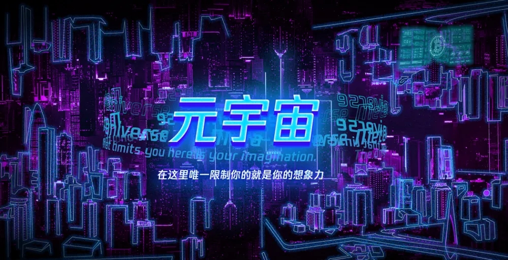

## 元宇宙是什么意思？

前一段时间，突然被“元宇宙”这个比较抽象的概念刷屏了，宇宙的概念大家都比较了解，但是，元宇宙是什么意思？该如何定义元宇宙？下面就为大家详细介绍一下，**什么是元宇宙？为什么元宇宙火了?**

*希望通过本文能够帮助大家更加深刻的了解元宇宙这个词。*

> 什么是元宇宙？

1. 元宇宙（Metaverse）这个词起源于Neal Stephenson在1992年出版的小说《雪崩》，“Metaverse”这个词，Metaverse本身就是由 Meta （意即“超越”、“元”）和 verse （意即“宇宙 universe”）两个词构成的。其字面意思是一个超越宇宙的世界。更具体地说，这个“超越宇宙”的世界是指计算机生成的世界。
2.  元宇宙代表完全沉浸式的三维数字环境，以及更具包容性的网络空间，最终在技术的辅助下，元宇宙会成为一个跨越所有表征维度的共享在线空间。
3.  看到这里，聪明的你应该能理解元宇宙的意思了：元宇宙就是一个和现实世界有关联的虚拟世界。

- 电影《头号玩家》可以帮助大家理解元宇宙
- 如果还是难以理解的话，可以参考一下 2018 年的电影《头号玩家》。
- 在电影中，男主角带上 VR 头盔，就能进入一个极其逼真的虚拟游戏世界 ——“绿洲”，玩家可以在里面冒险和社交。而“绿洲”即是一个元宇宙。

---

