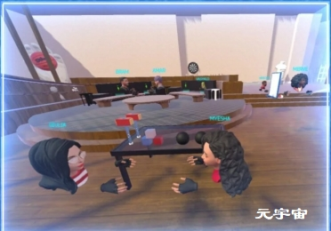

## 元宇宙引发的场景变革热潮下，医疗保健行业将有怎样的创新？

虽然数字模拟可以帮助医疗保健行业打破遇到的障碍瓶颈，但专家还是建议临床试验行业在这条道路上放慢脚步。

元宇宙有可能打破患者和临床医生之间的物理和地理障碍。想象一下，如果患者有一个数字孪生，且配备患者的医疗记录，那么患者就能够实现在数字世界中与临床试验研究人员见面会诊。这样看来，元宇宙可以用作改善患者行为的干预工具。

**但专家建议说，临床试验部门不应该太快进入元宇宙，因为这个行业需要一个坚实的基础来保证患者和数据的安全**。虚拟现实和远程医疗原则可以指导监管框架，但还需要一种定制和实施的方法。

“花点时间环顾一下四周，适应一下新的高度，”这是一条提醒VR用户的提示文本，因为该用户进入了一个模拟在高层剧院阳台边缘的场景。

当用户的头部移动时，视觉效果也会随之变化，以数字方式重现人们在现实生活中可能看到的场景。

这款VR是由ZeroPhobia的首席研究员兼联合创始人Tara Donker博士专门为恐高症人士开发的。ZeroPhobia是一款使用VR和AR的低成本移动App，该App使用的技术可以让恐惧症患者在不离开自己家的情况下勇敢克服自己内心的恐惧。

**新冠疫情揭示了可穿戴技术将临床试验从现场转移到患者家中的潜力**。随着技术的不断改进和普及，软件巨头也正在寻求另一个飞跃，那就是进入元宇宙。

南加州大学创意技术研究所医学VR技术主任Albert Rizzo博士解释说，元宇宙是一个人们可以通过VR头显访问并作为虚拟化身与他人交互的在线虚拟世界。

他补充说道，Meta（原Facebook）最近推广将元宇宙用于社交聚会，但同时元宇宙在医疗保健领域也极具潜力，人们可以进入虚拟医院，而无需面对面问诊。

**元宇宙可以用作临床试验中的去中心化工具，医生和患者可以利用虚拟化身进行会面咨询**。同时它还可以用作改善患者身心健康的治疗工具。

有趣的是，专家向临床试验机构Clinical Trials Arena表示，要确保患者安全和数据保护，有很多事情要做。目前我们尚不清楚医疗保健将如何融入元宇宙，如果虚拟宇宙是一个封闭的世界，那就意味着不是每个人都可以访问这个虚拟世界。

Rizzo指出，需要实施有关数据安全的法律隐私框架，就像美国的健康保险流通与责任法案（HIPAA）一样，元宇宙中的法律隐私框架需要被实施以保护患者。

## **改善青少年健康的元宇宙试验**

元宇宙可以被描述为使用VR、AR、区块链和人工智能（AI）的模拟或数字宇宙，允许用户作为虚拟化身进行交互。

加拿大公司PrecisionOS Technology的首席执行官Danny Goel博士补充说道，元宇宙是一个为人们消除旅行、时间和成本障碍的环境，该公司为外科培训提供AR和VR技术支持。“这是一个非常强大的实体，随着时间的推移它会变得越来越好，”Goel博士说道。

但是，目前尚未确定元宇宙在医疗保健中的作用，Ryan Lohre博士表示，他是一位为外科训练设计VR研究协议的整形外科医生。

**正如我们目前所知道的，由VR和AR驱动的医疗保健和临床试验将成为塑造元宇宙未来如何融入医疗保健行业的一部分**。“元宇宙和医疗保健可能会以与其他行业相同的速度发展，”他补充道。

目前已经有研究正在进行以测试元宇宙是否可以作为一种介入工具。阿克德尼兹大学儿科护理系教授Ayşegül İşler Dalgıç正在开发一个基于元宇宙的计划MetaHealth-Youth Project，以改善年轻人的健康行为。

尚未开始的多国临床试验（NCT05332886）将允许参与者进入三个元宇宙房间，在那里他们将学习健康营养、身体活动和压力管理技能，以减少非传染性疾病（NDC）的风险因素。

该研究预计招募600名年龄在15至24岁之间的学生。**参与者必须在健康生活方式行为量表II（HLBS II）上获得130或更低的分数，并且体重指数（BMI）水平等于或高于25 ，也就是说体重超重**。

而患有慢性或精神疾病的学生，以及像眩晕症这种会影响体验元宇宙的疾病也被排除在外。

Dalgıç解释说，年轻一代对科技的兴趣可能意味着未来元宇宙是否能够广泛传播，因此使用这样的平台将能够维持健康和教育系统的创新。

ClinicalTrials.gov上列出了另外两项在眼科中使用元宇宙辅助家庭监测模型的试验，而两项研究均在中国进行。 

## **元宇宙使远程医疗更上一层楼？**

让人们能够与彼此互动的数字模拟在医疗保健领域开辟了新的可能性，其中包括临床试验。“我们可以探索的社会和行为研究的方向是巨大的，”Goel博士补充道。

他解释说，元宇宙提供了以最低成本进行大规模临床试验的机会，因为它允许研究人员在短时间内接触到更多的人并收集更多的见解。

就像远程医疗一样，医生会通过3D模拟以虚拟形象与患者会面。**患者将成为一个虚拟化身代表，也就是一个拥有患者电子病历 (EMR)数据 的数字双胞胎**。

然而，Donker说，通过虚拟化身评估患者本身的症状并不适用于所有医疗领域。例如，在心理健康方面，患者的外表、个人卫生情况，甚至眼神都是判断患者是否能够照顾好自己的重要方面。

Donker补充说，去除人为因素可能弊大于利，评估患者的医生可能会错过许多非常重要的信息来作为诊断和治疗的基础。

在皮肤病学中，由于视频质量的问题，对皮肤问题的评估与现有远程医疗技术一样具有挑战性。

Dalgıç强调，**在他的MetaHealth-Youth Project试验中，为用户创建了虚拟化身，是以便医患之间彼此互动、交谈和进行其他身体活动的，而不是用于诊断目的**。

## **患者安全放在首位**

另一个需要考虑的关键因素是元宇宙将如何通过监管要求。Lohre说，元宇宙必须通过适当的监管以确保其安全、可靠、私密并尊重患者的自主权，“我们不能让行业领先于监管机构。”

如果将数字世界用于医疗保健行业，开发人员必须尊重当前有关临床试验和其背后的道德规范的建议，包括患者本人的同意和监测。Lohre指出，确定到底谁可以为青少年患者作出决定也是一个优先事项。

Rizzo说，**由于远程医疗和VR系属同一个类别，因此这些规定可能同样适用于元宇宙**。

然而，还是需要采取额外的预防措施和研究来确保元宇宙技术对患者来说是安全的。Rizzo补充说：“我们必须采取一些细小的步骤来确保我们能够确保患者的安全，这样黑客就无法进入元宇宙并在现场看患者受苦。”

Dalgıç说，MetaHealth-Youth Project是一个封闭的世界，**只有研究人员和参与者才能进入其中，这是为了确保所有人的安全以及对个人和健康数据的保护**。

然而，由于元宇宙作为一种医疗保健概念仍处于起步阶段，一旦有其他类型的元宇宙面向公众推出，很难说其可访问性将如何发挥作用。

Lohre说，在多个国家进行传统试验招募已经是一个挑战，因为每个国家都有不同的数据保护法。

创建一个人们可以从不同地区进入的虚拟空间将增加额外的数据保护挑战。“要做到这一点，需要许多不同监管机构之间的大量协作，”他补充道。

## **利用虚拟环境的暴露疗法**

虽然元宇宙将如何在试验中被使用，或者元宇宙是否可以用作治疗方法尚未完全确定，但实现目标的工具已经开始投入使用。

事实上，现有的心理健康领域的VR工具存在的时间比人们预期的还要长。Donker于2006年开始研究VR和心理健康，可实际上人类在这个方向最初的研究在90年代中期已经完成。

VR允许用户通过头显进入虚拟环境，而AR则是在现实世界环境中实现虚拟组件。**Donker说，这些技术允许用户控制虚拟空间，而这是与恐惧症相关的暴露治疗的有益工具**。

作为将AR作为治疗工具的一个案例，Donker将领导一项112名参与者的研究，针对患有蜘蛛恐惧症的人进行分为10个等级的AR治疗。

患者可以选择一只蜘蛛，无论是地窖蜘蛛还是更吓人的狼蛛，并与之互动。

在第一级时，患者可以决定蜘蛛的运动轨迹，但随着级别升高，蜘蛛将会获得更多的自主权。直到最高一级时，患者将看到一只母蜘蛛拖着自己的一群孩子爬过桌子。

目前该试验方案正在修订中，随机等待名单对照试验是调查ZeroPhobia工具是否能够在六周后提供任何改进且通过蜘蛛恐惧症问卷测量。

Donker指出，虚拟模拟消除了传统暴露疗法的弊端，例如现实生活中无法完全控制的动物或昆虫。**而像雷声、灯光或飞机上恐惧症在现实世界中复制起来要更加复杂，这就显示出了虚拟干预的另外一个好处**。

根据GlobalData的临床试验数据库，共有20项I-III期试验正在进行或计划研究各种恐惧症的不同治疗方法。

然而，引入任何像元宇宙一样的新技术都将面临早期挑战。但我们的目标是让元宇宙成为医疗保健超越当前状态的机会，Goel博士指出。

他还补充说，医疗保健行业一直以传统为基础，这是一个超越传统思考的机会，**尽管这个机会最初是抽象的，但在未来我们将能够以更具体的方式进行思考**。

数字宇宙的概念，听起来极具未来感，甚至这个宇宙可能是多重的，打破物理和地理障碍以探索协作世界的机会是十分诱人的。