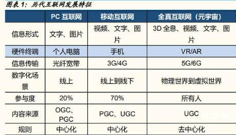

## 元宇宙时代ICT基础设施投资展望

### 一、ICT 基础设施是元宇宙时代多样化内容场景强大的底座支撑

元宇宙是虚拟世界与现实世界的融合，是现实世界的数字化承载。扎克伯格提 出元宇宙的八大特征：Presence（临场感）、Avatars（虚拟化身）、Home space（个人空间）、Teleporting（瞬间移动）、Interoperability（互通性）、 Privacy and safety（隐私与安全）、Virtual goods（虚拟物品）和 Natural interfaces（自然的交互）。我们认为，短期来看，元宇宙是在 5G、AI 等信息 技术以及硬件产品的支持下，带来更加沉浸的人机交互体验；长期来看，则是 为现实世界的物理场景构建虚拟世界的数字版本，从交互和连接层面大幅提升 各行业生产效率。在发展过程中，元宇宙会带来5/6G 网络、云计算、边缘计算、计算机视觉、机器学习、传感技术、区块链等广泛的技术迭代机会。

**1.1 元宇宙始于 XR，未来构建现实世界的数字孪生，赋能行业生产**

新型交互终端的出现，是移动互联网向元宇宙延伸的拐点。互联网至今已经历了 PC 互联网、移动互联网两大阶段，而 Metaverse元宇宙被认为是互联网的 下一代形态。沉浸感是元宇宙最重要的特征，终端硬件、人机交互技术和内容 是元宇宙的入口。提升沉浸感一是在于硬件终端人机交互方式的革新，如VR/AR、全息、体感、脑机等；二是在于配合终端吸引用户的内容应用。目前， Meta、苹果、腾讯、字节等科技巨头已围绕终端和应用展开激烈的竞争，未来 能够带来全新交互体验的终端何时普及，将是进入元宇宙的关键入口。

智能手机和平板电脑是移动互联网时代的主要载体，内容应用丰富推动算力计算、通信网络的迭代升级。2008 年 iPhone3G发布，智能手机出货量为 1.4 亿部，经过十年的发展，出货量发生了超过十倍的飞速跨越，到 2017 年达到 15.7 亿部。我们将 iPhone 视为划时代的智能手机终端产品，一是因为它带来 更智能、更便捷的触屏体验和操作系统，提高了人机交互水平；二是因为，基于智能手机，网购、社交、直播、短视频等越来越多的 APP 呈现给用户，替代 了 2G 时代传统手机短信、语音业务，成为催化 3G/4G 落地的杀手级应用。5G 的出现极大丰富了移动通信的应用场景，使智慧城市、智慧交通、智能制造、 智慧能源等成为可能。截至 2021 年底，我国共建成 4G 基站 590 万个，5G 基 站 142.5 万个，手机网民数量达到 10.3 亿。

功能属性来看，VR/AR 终端设备出货量可参考平板电脑出货量走势，目前处于 大规模量产前夕。整体上看，VR 在 2012 年开始，经历了 4 年的热捧，之后又 经历了 4 年的低谷，2020 年疫情也为 VR 带来了曙光。目前 VR 逐步走出谷底， 即将迎来 5-10年的稳定增长阶段。根据统计，2021 年全球 AR 出货量 57 万台， VR 出货量 1250 万台，整体较 2020 年增长 44%，成为行业公认的“奇点”。当 下 XR 的发展阶段，可类比苹果 iPhone/iPad 上市前阶段，处于大规模量产前 夕。随着产业链和技术不断发展，内容应用逐步繁荣，生态参与者加速入局， 整个元宇宙生态正在持续丰满。长期来看，XR 设备带来的虚拟沉浸感是平板电脑无法替代的，未来出货量将远超平板电脑。

VR 与 AR 存在相似的技术路径，但AR 比 VR 技术要求更为复杂，适用场景、 市场规模也更广泛。VR 是利用设备模拟一个虚拟世界，强调用户与沉浸式虚 拟世界的实时交互；而 AR 则借助算机图形技术和可视化技术产生真实世界中不存在的虚拟对象，并将虚拟对象准确“放置”在真实世界中。AR 的技术要求比 VR 更复杂，涉及与真实环境的融合，传感器和数据的融合等技术，但是 AR 技 术的适用场景也更广泛，收入规模也将大于 VR。在初期面向消费者的 AR 体验 承载于智能手机之上，而在今后 10-20 年内，AR 的重要载体是头戴式移动设 备。根据 IDC 估计，2021 年虽然售出了不到 100 万台 AR 眼镜和头戴设备， 但到 2025 年，预计 AR 设备销量将增长到 2340 万台，其中 2B 企业客户将贡 献总销量的 85%左右。根据方舟资本的预测，到 2030 年 AR 将深刻变革人们 的工作、购物、交互和娱乐体验， AR 的市场规模将从 10 亿美元扩大至 1 万亿 美元。根据华为发布的《AR 洞察及应用实践白皮书》，到 2025 年 AR 的市场 空间将达到 3000 亿美元，将优先在教育、社交、购物、出行导航和游戏这五 大行业得到规模应用。

元宇宙始于 VR/AR，绝不止于 VR/AR。看向元宇宙未来的终极形态，我们更 认同英伟达首席执行官黄仁勋的观点：“每个城市、建筑和工厂都会拥有一个数 字复制品，可以模拟和跟踪它的物理版本，生成我们数字孪生的虚拟世界。”英 伟达在 2020 年 10 月份推出了面向企业的实时仿真和协作平台 Omniverse 的 测试版，吸引了包括宝马、爱立信、沃尔沃在内的众多公司与之合作，掀起了 元宇宙的浪潮。在元宇宙时代，消费产品将出现虚实相生的趋势，未来可能很 多产品将形成虚拟化、数字化和实体化紧密结合的形态。未来各类产品可能将 更多出现虚实相生的趋势，消费者可以和产品以及企业产生更多的互动，并且 更加深入参与到产品的生产周期当中。

**1.2 参考 ICT 产业链，将元宇宙产业分为终端-承载-使能-计算-内容五部分**

我们参考 ICT 产业链，将其拆解为终端、承载、使能、计算和内容五个层面。 内容和终端是元宇宙的入口，通过 VR/AR、游戏等内容在终端呈现，实现元宇 宙的开放互联和沉浸体验；使能层通过 AI、区块链、3D 引擎渲染建模等技术， 构建虚拟世界、现实世界的数字孪生、经济系统等；承载和算力则是元宇宙的 技术底座，元宇宙终端交互场景多样，内容应用丰富，VR/AR、全息影像、体 感技术带来海量数据计算和传输需求，带动算力和网络技术迭代，拉动 ICT 基 础设施建设。

终端：当前 VR/AR 头显被普遍认为是进入元宇宙空间的主要终端 , 此外还包括 可穿戴设备、脑机接口等进一步提升沉浸度的设备。通过多形态交互设备、高 精度传感器件、多类型终端计算、高质量交互传输、全息影像、体感技术，从 场景、器件、技术等不同侧面增强沉浸式体验。 承载：通信技术和基础设施构建元宇宙支撑网络，千兆宽带、5G、WiFi6 等新 型通信技术增强网络能力，提升带宽、降低等性能，通过去中心化的网络架构 及与算力基础设施的协同融合，支撑元宇宙的超低时延、超大带宽需求。 使能：人工智能区块链使能元宇宙，帮助构建元宇宙体系；3D 能力引擎建模和 渲染，增加元宇宙真实性。

计算：终端设备算力有限，上云计算是必然趋势。为了支持元宇宙的海量接入、 真实建模与交互、大规模虚拟内容的创作与体验，需要通过算力基础设施将计 算能力从终端解放，并支持强大的云渲染及三维重建能力以及人工智能能力等。 边缘计算解决带宽和时延问题，主要表现为 CDN (Content Delivery Network, 内容分发网络) 演进升级+云计算资源下沉。 内容：游戏是目前最靠近元宇宙的 “入口”, 内容体验将从游戏继续进化。同 时，内容应用覆盖人类日常的各种生活场景，为用户提供更多娱乐、社交、消 费、学习和工作的内容。未来还将扩展至虚拟社区构建，加强和物理世界的融 合。

**1.3 沉浸式的内容应用依靠强大的算力和网络基础设施作为支撑**

元宇宙时代科技产业的代际更迭，价值链转移仍符合“基础设施-硬件-软件-平 台-应用和服务”规律。根据 IDC 数据，中国元宇宙相关 IT 支出将在 2025 年达 到近 2000 亿美元，2021~2025 年复合增长率将达到 20.2%。其中，AI 支出将 达 163 亿美元，占比 8%；大数据支出将达 255 亿美元，占比 13%；云计算支 出将达 814 亿美元，占比最大，约占总支出的 42%。在 Roundhill 的 METVETF 投资中，算力基础设施有关公司占比近 50%，其次是内容平台公司 28.82%、涉及到终端和使能的公司占比分别为 14.56%和 8.89%。

我们认为元宇宙的发展必须强化及重塑 ICT 基础设施，海量数据计算、传输需 求，将带来算力和网络的迭代升级。计算层的升级一方面要求芯片算力的提升； 另一方面要求云计算和边缘计算的协同分配，算力资源下沉，云服务厂商阿里 云、腾讯云、移动云等正着力布局边缘计算平台，CDN 厂商 Cloudflare、 Akamai、Fastly 等也在积极推动 CDN 演进升级为边缘计算系统。网络层则是 高带宽、低时延通信技术的升级，主要表现为 5/6G 普及、WiFi 6／7 技术发展、 千兆光纤入户和 10G FWA 升级。

### 二、算力层：围绕人工智能计算的云边协同优化算力分配

元宇宙是一个需要三维呈现的虚拟世界，里面的物理计算、图像渲染、人工智 能、动作捕捉、触觉反馈等都需要大量的算力支持。标准的摩尔定律曲线只能 让算力在未来五年内实现约 8 倍或 10 倍的增长。我们认为，元宇宙将带来计 算架构与部署方式的变革：一是，内容应用需要对海量并发非结构化数据进行 实时处理和分析，传统以 CPU 为核心的计算架构将无法满足需求；二是，终 端算力有限催生上云计算需求，算力资源在边缘侧部署满足低时延要求。围绕人工智能计算的云边协同优化算力分配将成为元宇宙计算升级的主要趋势。 边缘计算进入规模化建设期，未来五年边缘计算市场规模增速达 19%，产业链 上游基础设施及硬件厂商有望率先受益。由于边缘计算整体架构与云计算类似， 我们参照云计算“基础设施及硬件-软件平台-应用服务”的投资节奏。当前，ICT 巨头纷纷推出边缘计算架构和平台，边缘数据中心进入大规模建设期。Markets and Markets 预测，边缘计算市场规模将从 2021 年 365 亿美元增长至 2026 年 的 873 亿美元，CAGR19%。现阶段建议重点关注产业链上游的相关基础设施 及硬件厂商，如芯片、服务器和模块化数据中心建设。

**2.1 芯片：异构集成突破摩尔定律提高算力，存算一体降低时延和能耗**

人工智能是未来元宇宙中主要的生产工具，数据是生产要素，越来越多的内容 由 AI 生成。IDC 预测，到 2025 年，将有 414 亿台物联网设备，期间将产生 73147EB 数据，其中约四分之一是实时生成的。人工智能按照计算场景可分为 云端和终端。NVIDIA 将深度学习计算场景分为三大类：数据中心的训练、数据 中心的推断和嵌入式设备的推断。不同计算场景对 AI 芯片产生不同要求，云端 训练和推理时对芯片的计算能力要求极高，而终端对低功耗要求和反应时延较 高。随着人工智能向边缘侧的转移，AI 行业应用得到了极大扩展，也将成为元 宇宙时代内容的主要生产工具。根据德勤的分析，现在的 AI 计算已经在制造业、 政府、零售、电信、医疗等不同应用场景下获得应用。据市场咨询公司 ABI Research 的数据显示，预计到 2025 年，边缘 AI 芯片市场的收入将达到 122亿美元，云 AI 芯片市场的收入将达到 119 亿美元，边缘 AI 芯片市场将超过云 AI 芯片组市场。

异构集成+存算一体化是边缘 AI 芯片的核心竞争点。传统计算与存储设备分处 不同的模块，CPU 需先对存储硬盘上的数据进行读取、搜索、加/解密、压缩 等操作。但 AI 等应用的兴起，数据处理量不断上升，存算分离模式无谓的信息 传输不仅增加了计算延迟，也提升了相关功耗。根据台积电此前对存内计算的 研究，数据移动所消耗的能量甚至大于计算的能量消耗。与传统方式相比，计 算存储模块减少数据检索时间 90%，节省能耗 60%。在存内计算方面，三星走 在业界前沿，其开发的具有计算功能的 HBM2 内存已经开始在实际产品上进行 验证测试，将 HBM-PIM 与 Xilinx Alveo AI 加速计算服务器集成，将提升系统整 体性能 2.5 倍，同时降低能耗 60%以上。 元宇宙时代对计算量的需求，已经超过了通用 CPU 的发展速度，仅通过提升 CPU 时钟频率和内核数量而提高计算能力的传统方式遇到了散热和能耗瓶颈。 需要 GPU、FPGA、ASIC 等不同类型指令集和体系架构的计算单元，去配合 CPU 组成系统的计算方式。目前“CPU+GPU”以及“CPU+FPGA”都是受业界关 注的异构计算平台。