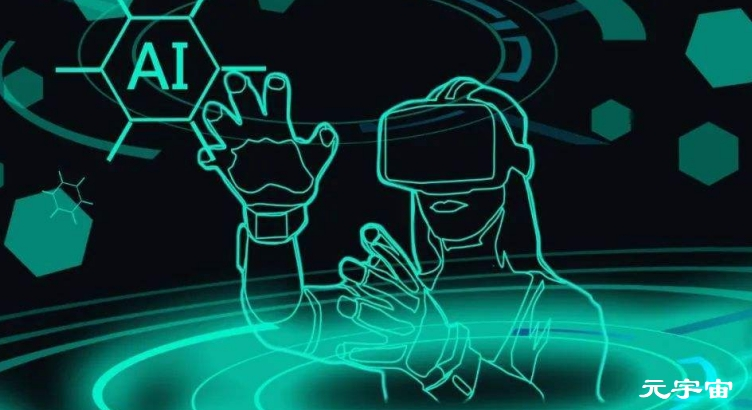

# 元宇宙是如何穿梭历史、现在、未来三个维度？

通过元宇宙，人类将在主观上感受到时间弹性与韧性增强，在物理时间依旧按照自然规律而演进时，元宇宙却从历史、现在、未来三个维度改变人们的时间认知。

**（一）元宇宙能够在虚拟层面再现历史**

根据熵增原理可知，系统的无序程度始终在增加，正如原本高度有序的完整杯子由桌面落到地板并裂为无序的碎片后，不可能再自动形成完整的杯子与跳回桌面一样，人类同样无法回到过去。史蒂芬·霍金使用上述示例生动地阐明时间的单向前进性与不可逆返性。虽然，元宇宙无法摆脱熵增原理而成为令物理世界的时间箭头发生调转的“时光机”，但是，元宇宙却能够成为将历史“移植”入虚拟世界的“运输器”。

在数字孪生技术、人工智能技术与人机互动技术等方面的帮助下，人将在元宇宙中实现历史场景的再造与历史事件的再演。“公共史”将在元宇宙中重现。“公共史”是以文字影音记录、考古发掘与科学研究为归纳手段，以向大众描摹人出现之前以及出现之后的自然境况的变化过程、社会群像的活动过程与重要人物的功过得失为旨归的公开历史。在元宇宙中，人能够在技术的辅助下，将“公共史”真实史料中记载的内容以立体化、全景化的方式投射至虚拟世界，并且模拟不同历史时期的气候条件、地理风貌、自然生物、物质生产、人文景观与社会矛盾，从而在若干年之后以置身其中的“当局者”的身份靠近、学习与理解历史。

元宇宙中亦可重现“私人史”。个体在参与家庭生活、学习工作与社会交往等进程中积累起来的私人记忆与经验，其知情受众人数、传播扩散范围与影响施效力度远远小于“公共史”，然而“私人史”之于个体确有无法替代的重大意义。进入元宇宙后，人掌握编辑世界的权利与工具，并且，虚拟人技术将在未来成熟，人能够以存储于头脑之中的回忆片段与可见于载体之上的旧时记录为基础蓝本，系统复刻曾经的场面，细致模仿曾经的活动，精确营造曾经的氛围，创造出以联系中断与已经故去的亲友形象为表征的虚拟人类，与采用预先编程手段，为之植入确保其能够对人在“肉体思想”指导下发出的讯号作出回应的“代码思想”，进而将疏离遥远的回忆转化为近在咫尺的“重逢”。

**（二）元宇宙能够在虚拟层面扩充现时**

马克思与恩格斯阐明，在生产力未达到极为发达的情况下，由于“性行为”“天赋”“需要”等方面的差异性，人“自发地”进入各不相同的劳动分工领域。在这种自然分工的条件下，人与人之间形成相应的劳动协作、产品分配与阶级划分等社会关系，这进一步导致，在一定时期内，人的日常活动范围、利益摄取方式与财富积累状况走向相对固定化。因此，在作为元宇宙之原生肌体的物理世界中，对于个体而言，生理特征与社会地位等因素导致人在数十年到百余年的生命时长内囿于较为单调的生命体验。

而元宇宙则致力于帮助人在有限的时间内沿袭常规生命安排的同时，丰富经历类型与拓展见识广度。人在元宇宙中行动时，需要凭借一个或者多个化身以实现个性表达与便利交往互动。虽然，化身背后的实际操控者是人，但是，人所使用的化身并非肉体形象的倒模再塑，亦非现实身份的拓印临摹。相反，人可以依据自身的心向与诉求，自由编定与变更化身的性别、年龄、种族、肤色、相貌、阶层、收入与爱好等特点，同其他化身建立交流、合作与陪伴关系，通过创设、选择与投入各异的场景，参加隶属于不同国别民族的特色活动，接受来自多种行业领域的工作挑战，模拟衍生于陌生文化群落的行为方式。在元宇宙中，人将有机会模拟与体验花鸟虫鱼等其他物种的生命历程。由此可见，元宇宙能够帮助人充分利用有限的生命时间，获得与现实生活不相一致乃至全然不同的多维生命经历。

**（三）元宇宙能够在虚拟层面刻画未来**

“未雨绸缪”“居安思危”等成语的出现与真理性表现，说明对于未来作出设想与预判是人类的重要习惯倾向。在元宇宙中，技术、经验与想象能够合力“缩短”由现在走向未来的时间周期，从而让“未来”提前到来，其主要表现在以下方面：其一，人能够预先尝试对于未来备选生存地点的体验、适应与改造。由于人类的过度活动，自然资源日益枯竭，环境污染四处漫溢，地球的宜居性无法得到长期保障。部分科学家认为，在未来，当地球的承载能力到达临界点时，移民至同地球的生存环境较为相似的火星或将成为一项可行的方案。而元宇宙有望成为人类移民的试验场。

在数字孪生技术的支持下，人能够利用通过太空考察而获得的火星土壤与水源样本以及其他科学数据，以对于火星的生存环境与生存条件进行预备的模拟体验，并且在其中探索以人类的需要为锚向而改造火星、以火星的特点为基点而规约人类行为的策略。其二，人能够在虚拟层面见证未来目标的实现状态。元宇宙中蕴藏众多供人进行世界编辑的素材与工具，在其帮助下，人可以根据自身对于未来的设想，在虚拟世界中构建与感受在现实生活中还未成型的目标生活。由此可见，在物理世界中尚未成为既成事件的未来，在元宇宙中有机会加速到站。